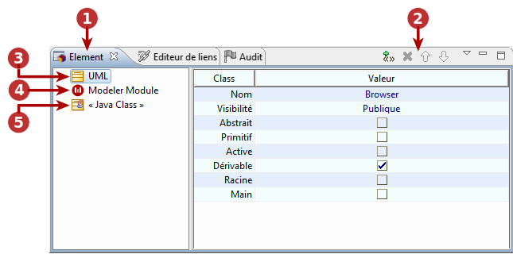
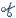
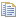
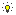

// Disable all captions for figures.
:!figure-caption:

[[La-vue-ldquoElémentrdquo]]

[[la-vue-elément]]
= La vue "Elément"

.La vue "Elément"

*Légende :*

1. L'onglet de la vue "Elément".
2. La barre d'outils de la vue "Elément".
3. Le groupe "UML".
4. Le groupe "Modeler Module".

[[Stéréotypes]]

[[stéréotypes]]
=== Stéréotypes

*Depuis le menu contextuel de la vue "Elément" :*

* *Ajouter un stéréotype* [image:images/Modeler-_modeler_interface_uml_prop_view_addStereotype_16.png[3] – Ajouter un ou plusieurs stéréotype(s)...] : Ouvre la fenêtre "Ajouter un(des) stéréotype(s)", dans laquelle vous pouvez sélectionner le stéréotype que vous souhaitez ajouter à l'élément sélectionné.
* *Supprimer* [image:images/Modeler-_modeler_interface_uml_prop_view_delete.png[8] – Supprimer / *Suppr*] : Supprime le stéréotype de l'élément sélectionné.
* *Couper* [ – Couper / *Ctrl+X*] : Coupe le stéréotype de l'élément sélectionné.
* *Copier* [ – Copier / *Ctrl+C*] : Copie le stéréotype de l'élément sélectionné.
* *Coller* [image:images/Modeler-_modeler_interface_uml_prop_view_paste_16.png[18] – Coller / *Ctrl+V*] : Colle le stéréotype à l'élément sélectionné.

*Depuis la barre d'outils de la vue "Elément" :*

* *Ajouter un stéréotype* [image:images/Modeler-_modeler_interface_uml_prop_view_addStereotype_16.png[3]] : Ouvre la fenêtre "Ajouter un(des) stéréotype(s)", dans laquelle vous pouvez sélectionner le stéréotype que vous souhaitez ajouter à l'élément sélectionné.
* *Supprimer* [image:images/Modeler-_modeler_interface_uml_prop_view_delete.png[8] / *Suppr*] : Supprime le stéréotype de l'élément sélectionné.
* *Déplacer le stéréotype vers le haut* [image:images/Modeler-_modeler_interface_uml_prop_view_up_16.png[11]] : Déplace le stéréotype d'une position vers le haut.
* *Déplacer le stéréotype vers le haut* [image:images/Modeler-_modeler_interface_uml_prop_view_down_16.png[12]] : Déplace le stéréotype d'une position vers le bas.

*Note :* Pour plus d'informations, voir "<<Modeler-_modeler_building_models_add_stereotypes.adoc#,Ajouter des stéréotypes aux éléments>>".

[[Le-groupe-UML]]

[[le-groupe-uml]]
=== Le groupe UML

.Le groupe "UML" de la vue "Elément"
image::images/Modeler-_modeler_interface_uml_prop_view_Element1.png[20]

*Légende :*

1.  Le groupe "UML".
2.  Le type de l'élément sélectionné.
3.  Un champs de type "Picking".
4.  Les propriétés UML de l'élément.

*Depuis la cellule "Valeur" de la propriété de votre choix :*

* *Saisir / Modifier une propriété simple* [clic gauche] : Active le champ "Valeur", vous permettant ainsi d'y saisir ou d'y modifier des informations.
* *Saisir / Modifier une propriété de type "picking" ()* [clic gauche] : Active la fonctionnalité "picking", qui vous permet de sélectionner un élémént dans une autre vue (les explorateurs ou les diagrammes) pour renseigner ce champ.
+
Vous pouvez également utiliser le raccourci[*Ctrl-Espace*] pour afficher une liste déroulante d'éléments disponibles pour sélection dans ce champ.

*Note :* Pour plus d'informations, voir "<<Modeler-_modeler_building_models_modifying_element_props.adoc#,Modifier des propriétés d'un élément>>".

[[Le-groupe-ldquoModeler-Modulerdquo]]

[[le-groupe-modeler-module]]
=== Le groupe "Modeler Module"

.Le groupe "Modeler Module" de la vue "Elément"
image::images/Modeler-_modeler_interface_uml_prop_view_Element2.png[21]

*Légende :*

1.  Le groupe "Modeler Module".
2.  Les tagged values.

*Depuis les champs des tagged values :*

* *Ajouter / Supprimer une tagged value qui ne prend pas de paramètres* [clic droit sur la case à cocher] : Ajoute la tagged value en question à l'élément sélectionné. Pour supprimer la tagged value de l'élément sélectionné, il suffit de décocher cette case.
* *Ajouter / Supprimer une tagged value pouvant prendre un seul paramètre* [clic droit sur le champ] : Active le champ "Valeur", qui vous permet de saisir directement une valeur pour le paramètre de la tagged value. Une fois une valeur définie, la tagged value est alors immédiatement ajoutée à l'élément sélectionné. Pour supprimer la tagged value de l'élément sélectionné, il suffit d'activer le champ "Valeur" et d'y supprimer la valeur définie pour le paramètre. La tagged value est alors immédiatement supprimée de l'élément sélectionné.
* *Ajouter une tagged value pouvant prendre plusieurs paramètres* [clic droit sur le champ] : Ouvre la fenêtre the "Editer les paramètres de tagged values", dans laquelle vous pouvez définir et ajouter des paramètres à une tagged value. Une fois une ou plusieurs valeurs définies, la tagged value est alors immédiatement ajoutée à l'élément sélectionné. Pour supprimer la tagged value de l'élément sélectionné, il suffit de cliquer dans le champ "Valeur", afin de rouvrir la fenêtre "Editer les paramètres de tagged values" et d'y supprimer tous les paramètres. La tagged value est alors immédiatement supprimée de l'élément sélectionné.

*Note :* Pour plus d'informations, voir "<<Modeler-_modeler_building_models_add_tv.adoc#,Ajouter des tagged values aux éléments>>".

