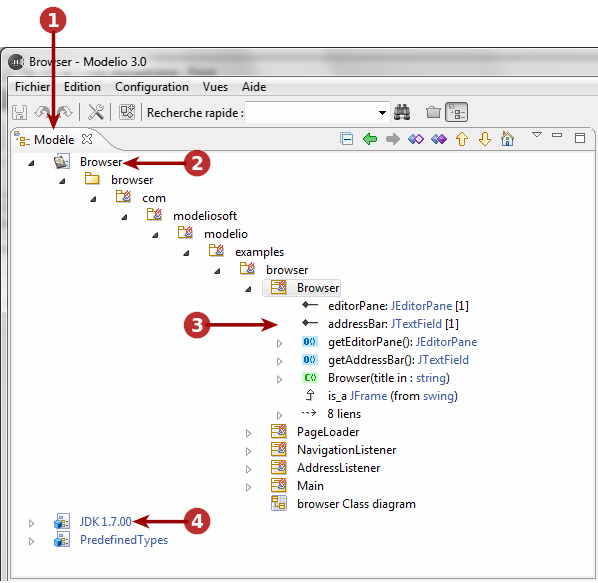
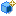
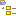

// Disable all captions for figures.
:!figure-caption:
// Path to the stylesheet files
:stylesdir: .

= La vue "Modèle"

.La vue "Modèle"

*Légende :*

1. L'onglet "Modèle".
2. Le modèle de travail local.
3. Les éléments du modèle.
4. Composant de modèle déployé (bibliothèque locale).

=== Principales commandes disponibles dans la vue "Modèle"

*Depuis les menus contextuels de l'explorateur de modèle :*

* *Créer un diagramme ou une matrice* [image:images/Modeler-_modeler_interface_uml_view_creationwizard.png[33] – Créer un diagramme ou une matrice...] : Lance un assistant à la création de diagrammes et de matrices (voir <<Modeler-_modeler_diagrams_creating_diagram.adoc#,Créer un diagramme>> pour plus d'informations)...
* *Créer un élément* [ – Créer un élément] : Crée l'élément de votre choix sous l'élément sélectionné.
* *Ajouter un / des stéréotype(s) à un élément* [image:images/Modeler-_modeler_interface_uml_view_addStereotype_16.png[15] – Ajouter un stéréotype...] : Ajoute un ou plusieurs stéréotypes à l'élément sélectionné.
* *Créer un stéréotype* [image:images/Modeler-_modeler_interface_uml_view_createstereotype.png[14] – Créer un stéréotype...] : Crée un nouveau stéréotype (voir <<Modeler-_modeler_mda_services_basic.adoc#,Niveau basique – Création d'un stéréotype>> pour plus d'informations).
* *Supprimer un élément* [image:images/Modeler-_modeler_interface_uml_view_delete.png[19] – Supprimer / *Suppr*] : Supprime l'élément sélectionné.
* *Couper un élément* [image:images/Modeler-_modeler_interface_uml_view_cut_16.png[16] – Couper / *Ctrl+X*] : Coupe l'élément sélectionné.
* *Copier un élément* [image:images/Modeler-_modeler_interface_uml_view_copy_16.png[17] – Copier / *Ctrl+C*] : Copie l'élément sélectionné.
* *Coller un élément* [image:images/Modeler-_modeler_interface_uml_view_paste_16.png[18] – Coller / *Ctrl+V*] : Colle l'élément sélectionné.
* *Lancer une macro* [image:images/Modeler-_modeler_interface_uml_view_scriptcatalog.png[34] – Macros] : Lance une macro (voir <<Modeler-_modeler_modelio_settings_macros_catalog.adoc#,Catalogue de macros>> pour plus d'informations)...
* *Créer / éditer / exporter / lancer un Pattern* [image:images/Modeler-_modeler_interface_uml_view_Pattern16.png[36] – Patterns] : Crée, édite, exporte ou lance un Pattern (voir <<Modeler-_modeler_patterns.adoc#,Patterns de modèle>> pour plus d'informations)...
* *Vérifier la cohérence du modèle* [ – Vérifier le modèle] : Vérifie la cohérence du modèle de manière récursive depuis l'élément sélectionné.
* *Créer / éditer / packager un composant de modèle* [ – Composants de modèle] : Crée, édite ou package un composant de modèle (voir <<Modeler-_modeler_local_libraries_model_components_development.adoc#,Développer et packager des composants de modèle>> pour plus d'informations)...
* *Lancer une opération d'import / export XMI* [image:images/Modeler-_modeler_interface_uml_view_XMI.png[24] – XMI] : Lance une opération d'import / export XMI de manière récursive depuis l'élément sélectionné (voir le chapitre sur l'<<Xmi_intro.adoc#,Import / Export XMI avec Modelio>> pour plus d'informations)...
* *Importer un modèle* [] : Lance une opération d'import de modèle (voir <<Modeler-_modeler_managing_projects_importing_elements.adoc#,Importer des éléments depuis des projets existants>> pour plus d'informations)...

*Depuis la barre d'outils de l'explorateur de modèle :*

* *Réduire tout* [] : Réduit tous les éléments et ne montre que le package racine.
* *Sélection précédente* [] : Recule d'un ou de plusieurs éléments dans l'historique des éléments sélectionnés.
* *Sélection suivante* [image:images/Modeler-_modeler_interface_uml_view_forward.gif[6]] : Avance d'un ou de plusieurs éléments dans l'historique des éléments sélectionnés.
* *Ouvrir dans un nouvel explorateur* [] : Ouvre un nouvel explorateur dont la racine est l'élément sélectionné.
* *Créer un élément frère* [] : Crée un élément frère à partir de l'élément sélectionné. Les éléments frères sont des éléments du même type que l'élément sélectionné situés au même niveau dans la hiérarchie du modèle.
* *Cloner l'élément* [] : Crée un clone de l'élément sélectionné. Les clones sont les copies conformes de leurs éléments d'origine. Ils ont les mêmes propriétés et le même contenu.
* *Déplacer vers le haut* [image:images/Modeler-_modeler_interface_uml_view_up.gif[10]] : Déplace l'élément sélectionné d'une position vers le haut dans la structure du modèle.
* *Déplacer vers le bas* [image:images/Modeler-_modeler_interface_uml_view_down.gif[11]] : Déplace l'élément sélectionné d'une position vers le bas dans la structure du modèle.
* *Sélectionner comme racine de l'explorateur* [image:images/Modeler-_modeler_interface_uml_view_select_as_root.gif[12]] : N'affiche que l'élément sélectionné et son contenu. Pour revenir vers la vue classique, il suffit de cliquer une deuxième fois.

*Note :* Pour plus d'informations, voir "<<Modeler-_modeler_building_models_creating_elements_cmcommand.adoc#,Créer des éléments en utilisant des commandes des menus contextuels>>".

