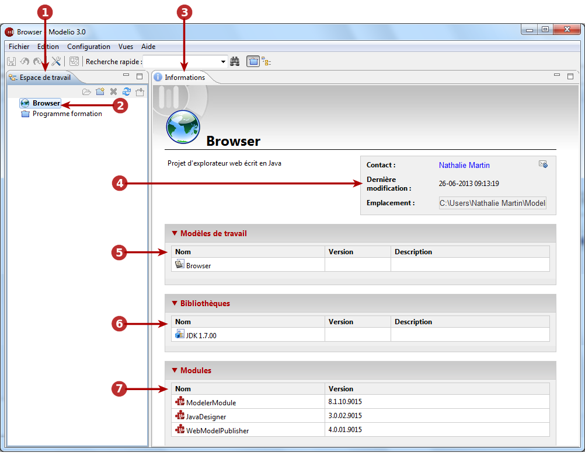
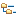

// Disable all captions for figures.
:!figure-caption:
// Path to the stylesheet files
:stylesdir: .

[[La-vue-ldquoEspace-de-travailrdquo]]

[[la-vue-espace-de-travail]]
= La vue "Espace de travail"

.La vue "Espace de travail"

*Légende :*

1. L'onglet "Espace de travail".
2. Les projets Modelio présents dans l'espace de travail.
3. Les informations sur le projet sélectionné.
4. La description et le contact du projet sélectionné. Vous pouvez cliquer sur l'icône [] pour envoyer un courriel à l'auteur du projet.
5. Les modèles de travail présents dans le projet sélectionné.
6. Les bibliothèques présentes dans le projet sélectionné.
7. Les modules présents dans le projet sélectionné.

[[Principales-commandes-disponibles-dans-la-vue-ldquoEspace-de-travailrdquo]]

[[principales-commandes-disponibles-dans-la-vue-espace-de-travail]]
===== Principales commandes disponibles dans la vue "Espace de travail"

*Depuis le menu "Fichier" :*

* *Créer un projet* [image:images/Modeler-_modeler_interface_workspace_view_newProject_16.png[3] – Créer un projet... / *Ctrl+N*] : Crée un nouveau projet.
* *Sauvegarder le projet courant* [image:images/Modeler-_modeler_interface_workspace_view_saveProject_16.png[4] – Sauvegarder le projet / *Ctrl+S*] : Sauvegarde le projet courant.
* *Fermer le projet courant* [image:images/Modeler-_modeler_interface_workspace_view_navClosedProject_16.png[5] – Fermer le projet] : Ferme le project courant.
* *Importer un projet* [image:images/Modeler-_modeler_interface_workspace_view_import_project_16.png[8] – Importer un projet... / *I*] : Importe un projet entier (*.zip) dans l'espace de travail courant.
* *Changer d'espace de travail* [ – Changer d'espace de travail...] : Change d'espace de travail.
* *Quitter Modelio* [ – Fermer] : Ferme et quitte Modelio.

*Depuis le menu contextuel :*

* *Ouvrir un projet* [ – Ouvrir le projet / double-clic / *O*] : Ouvre un projet existant.
* *Fermer le projet courant* [image:images/Modeler-_modeler_interface_workspace_view_navClosedProject_16.png[5] – Fermer le projet] : Ferme le projet courant.
* *Supprimer un projet* [image:images/Modeler-_modeler_interface_workspace_view_delete.png[11] – Supprimer le project / *Del*] : Supprime un projet existant.
* *Exporter un projet* [image:images/Modeler-_modeler_interface_workspace_view_export_project_16.png[13] – Exporter le project.../ *X*] : Exporte un projet entier dans une archive zippée.

*Note :* Pour plus d'informations, veuillez vous reporter à "<<Modeler-_modeler_managing_projects_create_project.adoc#,Créer un projet>>" et "<<Modeler-_modeler_managing_projects_configuring_project_informations.adoc#,Configurer les informations du projet>>".

