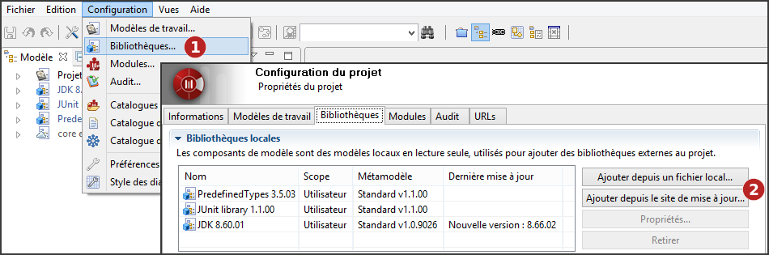
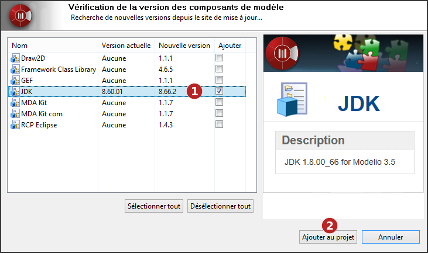

// Disable all captions for figures.
:!figure-caption:
// Path to the stylesheet files
:stylesdir: .

= Déployer un composant de modèle

===== Introduction

Le déploiement d'un composant de modèle est la première phase orientée utilisateur du cycle de vie du modèle (par opposition aux phases de <<Modeler-_modeler_local_libraries_model_components_development.adoc#,développement et de production>>).

Les composants de modèle sont déployés par des utilisateurs qui souhaitent les exploiter dans leurs projets. Lorsqu'un composant de modèle a été déployé dans un projet, lui et les éléments de modèle qu'il contient sont affichés en bleu dans la vue "Modèle" et sont en mode lecture seule.

Si un composant de modèle dépend d'un autre composant de modèle, l'autre composant de modèle doit être déployé en premier.

Le déploiement d'un composant de modèle inclut les opérations suivantes :

* La sélection du composant de modèle qui va être déployé sur votre projet,
* La résolution des éventuelles erreurs de déploiement rencontrées.

La gestion des bibliothèques se fait dans l'onglet *Bibliothèques* de la fenêtre *Configuration du projet*.

.Configuration des bibliothèques du projet

*Étapes :*

1.  Cliquez sur "Configuration \ Bibliothèques..." ou sur l'icône [image:images/Model_components_deployment_config.png[3]] puis l'onglet "Bibliothèques".
2.  Vous pouvez ajouter de nouvelles bibliothèques locales à votre projet, depuis un fichier local ou depuis le site de mise à jour.

===== Déploiement depuis un fichier local

.Déploiement d'un composant de modèle depuis un fichier local
image::images/Model_components_deployment_AjoutRamcPuces.png[7]

*Étapes :*

1.  Choisissez le composant de modèle (*.ramc file) que vous souhaitez ajouter ou mettre à jour dans votre projet.
2.  Tous les modules obligatoires ne sont pas déployés dans le projet sur lequel vous souhaitez déployer votre composant de modèle. Si le composant de modèle que vous souhaitez déployer inclut des notes ou des tagged values spécifiques à un module donné, alors ce module doit être déployé dans votre projet avant que vous ne déployiez le composant de modèle. Les modules manquants sont signalés en rouge. Pour résoudre ce problème, il suffit de lancer la commande "Configuration / Modules" et d'installer le module qu'il vous faut.
3.  Une <<Modeler-_modeler_local_libraries_model_components_lifecycle.adoc#,dépendance>> entre le composant de modèle que vous souhaitez déployer et un autre composant de modèle qui doit être déployé d'abord n'est pas respectée. Les composants de modèle manquants sont signalés en rouge.Pour résoudre ce problème, il suffit de déployer dans sa version exacte l'autre composant de modèle (indiqué dans le champ "Dépendances") dans votre projet. Vous pouvez alors relancer l'opération de déploiement du composant de modèle que vous souhaitez déployer.
4.  Cliquez sur 'Ajouter au projet'.

===== Déploiement depuis le site de mise à jour

.Déploiement d'un composant de modèle depuis le site de mise à jour

*Étapes :*

1.  Sélectionnez le ou les composants de modèle que vous souhaitez ajouter ou mettre à jour dans votre projet.
2.  Cliquez sur 'Ajouter au projet'.

*Note :* L'adresse du site de mise à jour est définie par l'option 'Site de mise à jour' du groupe 'Mises à jour' dans les préférences de Modelio (Menu "Configuration / Préférences")

