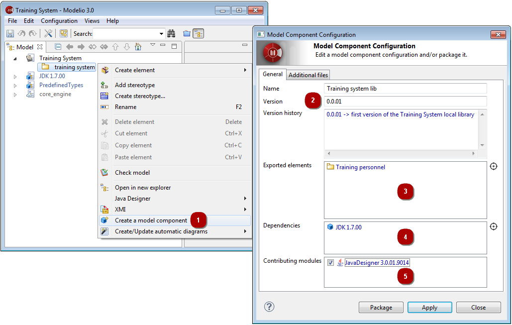

// Disable all captions for figures.
:!figure-caption:
// Path to the stylesheet files
:stylesdir: .

= Développer et produire un composant de modèle

===== Introduction

Le développement d'un composant de modèle est la première phase du cycle de vie du composant de modèle, durant laquelle, le composant de modèle est préparé par le développeur en vue de son packaging.

Le développement d'un composant de modèle inclut les opérations suivantes :

* Le modèle UML doit tout d'abord être construit (y compris les éventuelles annotations de code que vous souhaitez y inclure),
* Le composant de modèle doit ensuite être créé et défini. Cela inclut la création du futur composant de modèle lui-même (nom, description, numéro de version), ainsi que la définition de son contenu (modèle et fichiers externes) et ses dépendances d'autres composants de modèle.

Cette section décrit la création et la définition d'un composant de modèle.

===== Créer un composant de modèle

La première étape dans le développement d'un composant de modèle est sa création dans un modèle UML.

Pour créer un composant de modèle, suivez les étapes illustrées ci-dessous.

.Création d'un nouveau composant de modèle

*Étapes :*

1.  Cliquez droit sur la racine de votre projet et lancez la commande "Créer un composant de modèle.
2.  Saisissez un nom, une version et un historique de version.
3.  Depuis l'explorateur UML, glissez-déposez les éléments de modèle que votre composant de modèle va référencer.
4.  Depuis l'explorateur UML, glissez-déposez les composants de modèle sur lesquels dépendra votre composant de modèle.
5.  Cochez la case des modules qui contribuent à votre composant de modèle.

===== Définition des parties de modèle à inclure dans le composant de modèle

Les éléments de modèle à inclure dans un composant de modèle sont référencés à l'aide de liens de manifestation. Ces éléments seront disponibles et prêts à être utilisés dans les projets sur lesquels sera déployé le composant de modèle. Seuls les packages de haut niveau (situés directement sous la racine du projet) peuvent être référencés par un composant de modèle à l'aide d'un lien de manifestation. Cependant, tous les éléments qu'ils contiennent seront également packagés dans le composant de modèle.

===== Modélisation des dépendances entre composants de modèle

Si votre composant de modèle dépend d'un autre composant de modèle, cette dépendance doit être modélisé sous la forme d'un lien d'utilisation.

===== Définition des fichiers externes à inclure dans le composant de modèle

Il est également possible d'inclure des fichiers externes dans un composant de modèle. Ceci est particulièrement utile lorsque vous voulez que composant de modèle installe des fichiers spécifiques tels que des bibliothèques, des fichiers .jar ou des fichiers de ressources lors de son déploiement.

Imaginons par exemple que vous avez reversé le JDK afin d'en faire un composant réutilisable. Ce type de composant de modèle, lorsqu'il sera déployé, permettra le développement d'applications Java, y compris la compilation, ce qui signifie que les fichiers .jar du JDK devront être déployés par le composant de modèle.

Lors de la définition de fichiers externes à inclure dans votre composant de modèle, la variable $(GenRoot) est utilisée. Cette variable représente le répertoire racine pour la génération et est définie par chaque utilisateur au niveau des paramètres de Modelio. Cela signifie que les fichiers externes inclus dans le composant de modèle seront déployés correctement dans l'environnement de chaque utilisateur.

Une fois ces opérations effectuées à votre satisfaction, cliquez sur "Modifier" pour valider les modifications que vous avez apportées et fermer la fenêtre d'édition du composant de modèle. Vous pouvez maintenant procéder à la production de votre composant de modèle en cliquant sur "Produire".

