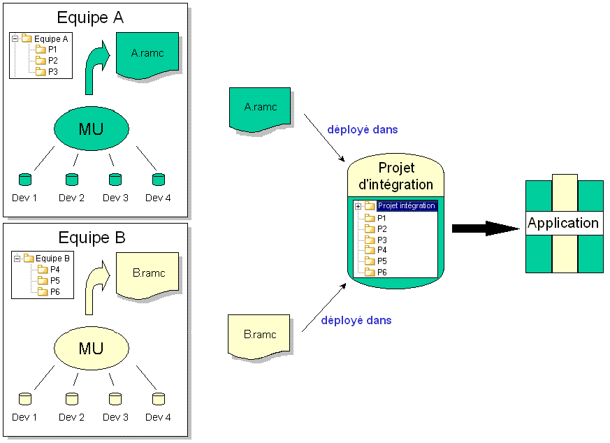

// Disable all captions for figures.
:!figure-caption:
// Path to the stylesheet files
:stylesdir: .

[[Introduction-aux-composants-de-modèle]]

[[introduction-aux-composants-de-modèle]]
= Introduction aux composants de modèle

[[Quest-ce-quun-composant-de-modèle-]]

[[quest-ce-quun-composant-de-modèle]]
===== Qu'est-ce qu'un composant de modèle ?

Un composant de modèle est une partie de modèle indépendante, identifiée et cohérente, issue d'un modèle plus important et packagée en un fichier unique.

Les composants de modèle peuvent contenir les éléments suivants:

* Des extraits de modèle stables,
* Des types de tagged values et de notes spécifiques à certains modules,
* Des fichiers externes.

Parfois appelés RAM Components (reusable autonomous model components), les composants de modèle sont utilisés dans un contexte de travail en équipe pour permettre à des développeurs ou des équipes de développeurs différentes travaillant sur un même projet de ne travailler que sur une partie limitée du projet complet.

Les composants de modèle ont un <<Modeler-_modeler_local_libraries_model_components_lifecycle.adoc#,numéro de version>>. A intervalles réguliers, chaque composant de modèle peut être repackagé, et son numéro de version incrémenté, avant d'être livré à un projet d'intégration dans lequel l'application complète sera assemblée.

Comme il est impossible d'isoler totalement une partie d'un projet de développement de toutes les autres parties, un composant de modèle peut dépendre d'autres composants de modèle. Pour plus d'informations concernant les dépendances entre les composants de modèle, voir "<<Modeler-_modeler_local_libraries_model_components_lifecycle.adoc#,Le cycle de vie d'un composant de modèle>>".

[[Quels-avantages-présente-lutilisation-des-composants-de-modèle-]]

[[quels-avantages-présente-lutilisation-des-composants-de-modèle]]
===== Quels avantages présente l'utilisation des composants de modèle ?

Dans un projet multi-utilisateur à grande échelle, avec plusieurs personnes travaillant en même temps dans un même espace de travail, il peut s'avérer difficile de gérer efficacement toutes les interactions qui entrent en compte.

Les composants de modèle vous permettent d'augmenter votre efficacité en réduisant la taille des différents extraits de modèles impliqués dans votre projet, ainsi que le nombre de personnes travaillant sur chaque partie. Cela signifie que chaque équipe de développement peut progresser dans son propre espace de travail en fonction de son calendrier, sans affecter les autres participants au projet (voir ci-dessous).

.Utilisation des composants de modèle

