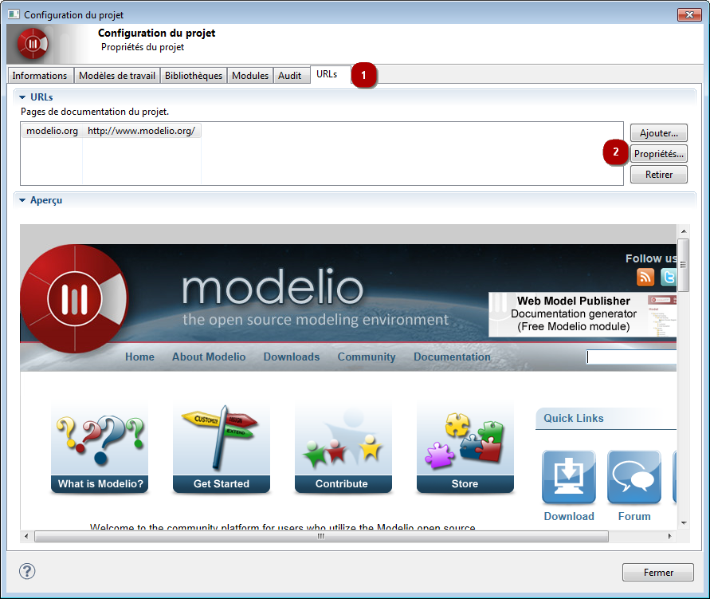

// Disable all captions for figures.
:!figure-caption:
// Path to the stylesheet files
:stylesdir: .

[[Configurer-les-URLs-du-projet]]

[[configurer-les-urls-du-projet]]
= Configurer les URLs du projet

Avec Modelio, vous avez la possibilité d'associer des pages d'informations customisées à chaque projet. +
Ces pages sont affichées dans la _vue "Espace de travail"_ sous la forme d'onglets supplémentaires.

Les pages d'informations customisées peuvent être utilisées, par exemple, pour afficher la documentation du projet, la liste d'anomalies à corriger, le planning du projet, l'état des builds, ou plus généralement, toute autre information qui pourrait être utile au développeur.

La configuration des pages d'informations customisées se fait dans l'onglet *URL* de la fenêtre de *configuration du projet*.

.Configuration des URLs du projet

*Étapes :*

1.  Cliquez sur l'icône [image:images/Modeler-_modeler_managing_projects_configuring_project_URL_config.png[3]] dans la barre d'outils principale afin d'ouvrir la fenêtre de *configuration du projet*. Choisissez l'onglet *URLs*.
2.  Utilisez le bouton approprié afin de :
* *Ajouter* – ajouter une URL à votre projet.
* *Propriétés* – modifier une URL existante.
* *Retirer* – retirer une URL.

Le contenu de l'URL sélectionnée s'affiche dans la zone de visualisation.

