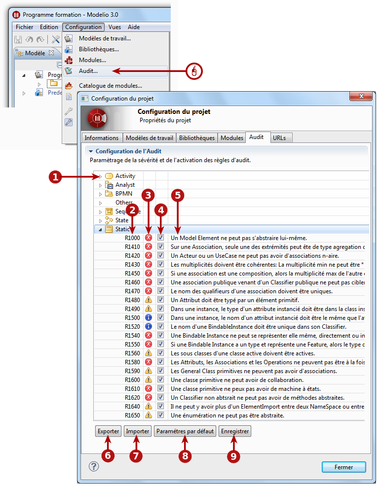

// Disable all captions for figures.
:!figure-caption:
// Path to the stylesheet files
:stylesdir: .

[[Configurer-laudit-du-projet]]

[[configurer-laudit-du-projet]]
= Configurer l'audit du projet

Modelio vous apporte un ensemble de règles d'audit pré-définies qui vous aideront à développer des modèles corrects et cohérents. +
Chacune de ces règles peut être activée, désactivée ou configurée afin de lui donner une sévérité particulière.

.L'outil de configuration de l'audit

*Légende :*

1. Les règles sont organisées par méta-classe.
2. Le numéro de la règle d'audit.
3. La sévérité de la règle d'audit. Trois niveaux de sévérité sont disponibles : *Erreur*, *Avertissement* ou *Conseil*. Ceci indique la sévérité de la diagnostique appliquée par la règle en question.
4. Cette case à cocher vous permet d'activer ou de désactiver la règle. Une règle désactivée n'est jamais appliquée et ne produit aucun résultat.
5. La description de la règle.
6. Ce bouton vous permet d'exporter la configuration courante dans un fichier (par exemple, afin de pouvoir l'utiliser dans un autre projet).
7. Ce bouton vous permet d'importer la configuration depuis un fichier.
8. Ce bouton vous permet de revenir à la configuration par défaut.
9. Ce bouton vous permet de sauvegarder la configuration de l'audit, et d'appliquer la configuration affichée à votre projet.

