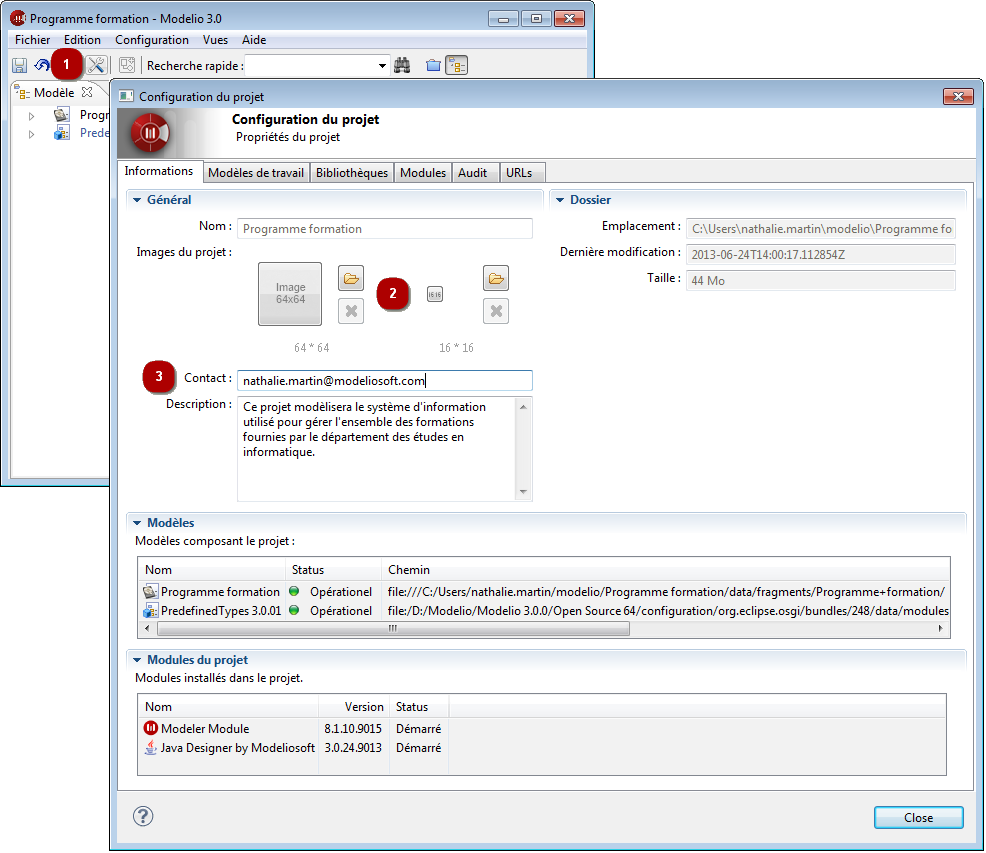

// Disable all captions for figures.
:!figure-caption:

= Configurer les informations du projet

Vous pouvez personnaliser chaque projet afin de le rendre plus facilement identifiable dans la vue "Espace de travail". +
Cette customisation se fait dans l'onglet *Informations* de la fenêtre "Configuration du projet".

.Configuration des informations d'un projet

*Étapes :*

1.  Cliquez sur l'icône [image:images/Modeler-_modeler_managing_projects_configuring_project_informations_config.png[3]] puis sélectionnez l'onglet *Informations* dans la fenêtre.
2.  Vous pouvez choisir une image 64x64 et / ou 16x16 pour votre projet.
3.  Vous pouvez éditer les informations sur la description du projet, ainsi que la personne à contacter à son sujet.

L'icône 16x16 sera utilisée pour représenter le projet dans l'explorateur de l'espace de travail. +
L'image 64x64 apparaîtra sur la page d'informations sur le projet, avec la description du projet et le nom de la personne à contacter à son sujet.

