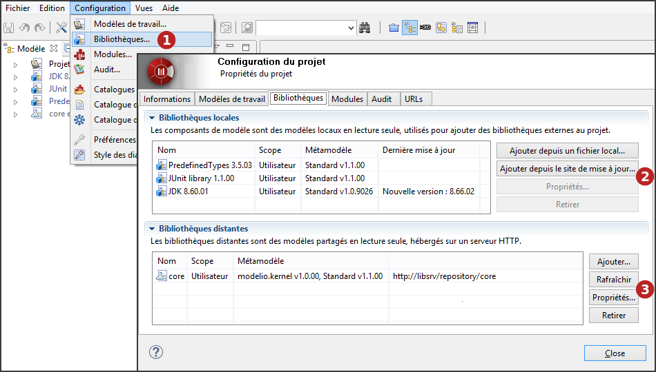
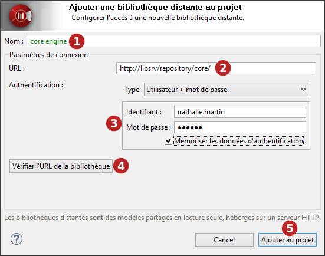

// Disable all captions for figures.
:!figure-caption:
// Path to the stylesheet files
:stylesdir: .

[[Configurer-les-bibliothèques-du-projet]]

[[configurer-les-bibliothèques-du-projet]]
= Configurer les bibliothèques du projet

Une *bibliothèque de modèle* dans un projet Modelio est un ensemble d'éléments de modèle non-modifiables nécessaires au développement de votre projet, packagés dans un seul et unique artéfact.

Un exemple très basique pour les projets Java est le JDK. Afin de modéliser correctement une application Java, plusieurs classes du JDK sont utilisées, soit pour l'extension par l'héritage, soit comme composants des compositions et associations de votre modèle. Ces classes du JDK sont emmenées dans votre projet par une *bibliothèque de modèle*. Votre but n'est évidemment pas d'éditer ou de modifier le modèle du JDK, et pour cette raison, les modèles fournis par les bibliothèques sont en *lecture seule*.

Il existe deux types de bibliothèques dans Modelio :

* *Les bibliothèques de composants de modèle*, qui sont des bibliothèques locales similaires aux composants de modèle disponibles dans Modelio 2
* *Les bibliothèques HTTP*, qui sont des bibliothèques distantes accessibles via HTTP et par conséquent distribuées

Vous pouvez déclarer autant de bibliothèques que nécessaire dans votre projet, qu'elles soient locales ou distantes.

La gestion des bibliothèques se fait dans l'onglet *Bibliothèques* de la fenêtre *Configuration du projet*.

.Configuration des bibliothèques du projet

*Étapes :*

1.  Cliquez sur "Configuration \ Bibliothèques..." ou sur l'icône [image:images/Modeler-_modeler_managing_projects_configuring_project_libraries_config.png[3]] puis l'onglet "Bibliothèques".
2.  Vous pouvez ajouter de nouvelles bibliothèques locales à votre projet, depuis un fichier local ou depuis le site de mise à jour, consulter ou supprimer des bibliothèques locales existantes.
3.  Vous pouvez ajouter de nouvelles bibliothèques distantes, ou bien rafraîchir, consulter ou supprimer des bibliothèques distantes existantes.

[[Ajouter-des-composants-de-modèle]]

[[ajouter-des-composants-de-modèle]]
=== Ajouter des composants de modèle

Les composants de modèle sont déployés par les utilisateurs qui souhaitent les utiliser dans leurs propres projets. Lorsqu'un composant de modèle a été déployé dans un projet, lui et les éléments de modèle qu'il contient sont affichés en bleu dans la vue "Modèle" et sont en mode lecture seule.

Pour déployer un composant de modèle, il y a plusieurs moyens à votre disposition :

[[Depuis-un-fichier-local]]

[[depuis-un-fichier-local]]
===== Depuis un fichier local

.Déploiement d'un composant de modèle depuis un fichier local
image::images/Modeler-_modeler_managing_projects_configuring_project_libraries_AjoutRamcPuces.png[7]

*Étapes :*

1.  Choisissez le composant de modèle (*.ramc file) que vous souhaitez ajouter ou mettre à jour dans votre projet.
2.  Tous les modules obligatoires ne sont pas déployés dans le projet sur lequel vous souhaitez déployer votre composant de modèle. Si le composant de modèle que vous souhaitez déployer inclut des notes ou des tagged values spécifiques à un module donné, alors ce module doit être déployé dans votre projet avant que vous ne déployiez le composant de modèle. Les modules manquants sont signalés en rouge. Pour résoudre ce problème, il suffit de lancer la commande "Configuration / Modules" et d'installer le module qu'il vous faut.
3.  Une <<Modeler-_modeler_local_libraries_model_components_lifecycle.adoc#,dépendance>> entre le composant de modèle que vous souhaitez déployer et un autre composant de modèle qui doit être déployé d'abord n'est pas respectée. Les composants de modèle manquants sont signalés en rouge.Pour résoudre ce problème, il suffit de déployer dans sa version exacte l'autre composant de modèle (indiqué dans le champ "Dépendances") dans votre projet. Vous pouvez alors relancer l'opération de déploiement du composant de modèle que vous souhaitez déployer.
4.  Cliquez sur 'Ajouter au projet'.

[[Depuis-le-site-de-mise-à-jour]]

[[depuis-le-site-de-mise-à-jour]]
===== Depuis le site de mise à jour

.Déploiement de composants de modèle depuis le site de mise à jour
image::images/Modeler-_modeler_managing_projects_configuring_project_libraries_AjoutRamcUpdateSitePuces.png[11]

*Étapes :*

1.  Sélectionnez le ou les composants de modèle que vous souhaitez ajouter ou mettre à jour dans votre projet.
2.  Cliquez sur 'Ajouter au projet'.

*Note :* L'adresse du site de mise à jour est définie par l'option 'Site de mise à jour' du groupe 'Mises à jour' dans les préférences de Modelio (Menu "Configuration / Préférences")

Pour plus d'informations sur les bibliothèques locales (composants de modèle), voir "<<Modeler-_modeler_local_libraries_model_components_presentation.adoc#,Introduction aux composants de modèle>>".

[[Ajouter-des-bibliothèques-distantes]]

[[ajouter-des-bibliothèques-distantes]]
=== Ajouter des bibliothèques distantes

Les bibliothèques distantes sont déployées par les utilisateurs qui souhaitent les utiliser dans leurs propres projets. Lorsqu'une bibliothèque distante a été déployée dans un projet, elle et les éléments de modèle qu'elle contient sont affichés en bleu dans la vue "Modèle" et sont en mode lecture seule.

Pour déployer une bibliothèque distante, suivez la procédure montrée dans les captures d'écran ci-dessous.

.Déploiement d'une bibliothèque distante

*Étapes :*

1.  Saisissez le nom qui sera utilisé pour la bibliothèque distante dans l'explorateur de modèle.
2.  Saisissez l'URL de la bibliothèque distante.
3.  Le cas échéant, saisissez l'utilisateur et le mot de passe.
4.  Vous pouvez vérifier l'URL de la bibliothèque distante.
5.  Cliquez sur 'Ajouter au projet'.

Pour plus d'informations sur les bibliothèques distantes (les modèles HTTP), voir "<<Modeler-_modeler_remote_libraries_distant_libraries_presentation.adoc#,Introduction aux bibliothèques distantes>>".

