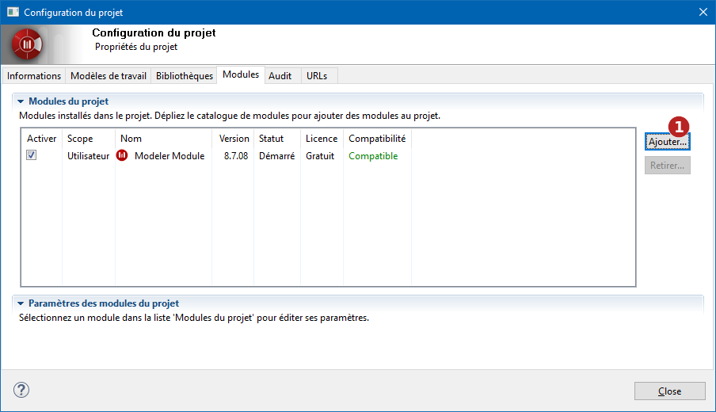
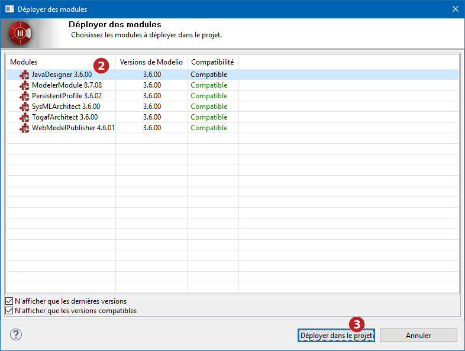
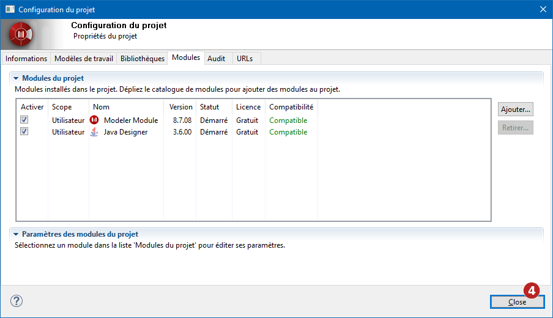
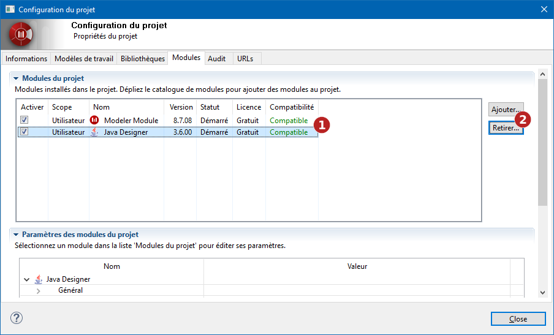
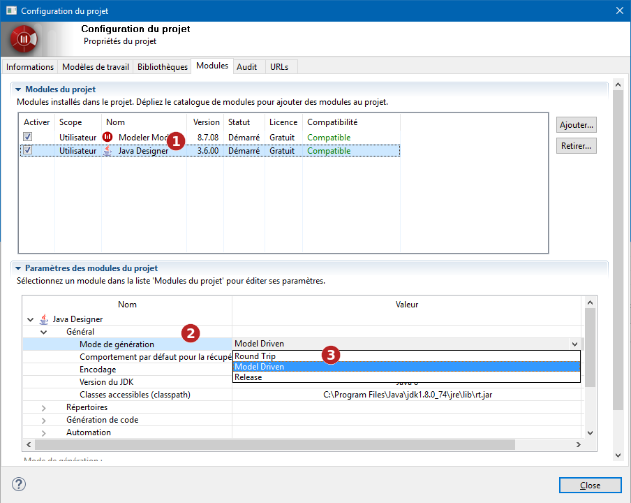

// Disable all captions for figures.
:!figure-caption:

[[Configurer-les-modules-du-projet]]

[[configurer-les-modules-du-projet]]
= Configurer les modules du projet

[[Quest-ce-quun-module-Modelio-]]

[[quest-ce-quun-module-modelio]]
===== Qu'est-ce qu'un module Modelio ?

Les modules Modelio sont des composants complémentaires contenant chacun des services spécifiques à un besoin de modélisation particulier.

La gamme Modelio comprend un certain nombre de modules qui exploitent les modèles pour un besoin spécifique (par exemple, la génération de documentation ou la génération de code Java ou C++).

Après son installation, un module Modelio fournit les menus, icônes et annotations spécialisées spécifiques au module en question. Certains modules apportent également leur propre vue, facilitant ainsi la saisie d'informations spécifiques au module en question, comme des notes ou des tagged values dédiées.

*Note :* Pour ouvrir l'onglet "Modules" de la fenêtre de configuration du projet, il suffit de lancer la commande "image:images/Modeler-_modeler_managing_projects_configuring_project_modules_module.png[9] Modules..." depuis le menu "Configuration".

[[Installer-un-module-dans-un-projet]]

[[installer-un-module-dans-un-projet]]
===== Installer un module dans un projet

 
 
.Installation d'un module dans un projet

*Étapes :*

1. Cliquer sur le bouton *Ajouter* pour afficher le catalogue des modules +
2. Dans la fenêtre de déploiement de module, sélectionner le module à déployer dans le projet +
3. Cliquer sur le bouton *Déployer dans le projet* pour valider +
4. Cliquer sur le bouton *Fermer* pour quitter la fenêtre "Configuration du projet"

[[Activer-Désactiver-un-module]]

[[activer-désactiver-un-module]]
===== Activer /Désactiver un module

Modelio vous donne la possibilité d'activer ou de désactiver à tout moment un module que vous avez installé dans l'un de vos projets.

Lorsque vous installez un module dans un projet Modelio , il est automatiquement activé (sa case est cochée).

Si vous désactivez un module, il reste disponible dans votre projet, et vous pouvez toujours visualiser et utiliser ses extensions spécifiques. Ceci peut être utile pour les membres d'une équipe qui n'ont pas besoin de travailler avec un module donné mais qui ont tout de même besoin de visualiser les annotations du module utilisées par d'autres membres de l'équipe.

Pour activer ou désactiver un module dans votre projet, il suffit de cocher / décocher la case "Activer" (voir l'image ci-dessous).

.Activation / Désactivation de modules dans votre projet
image::images/Modeler-_modeler_managing_projects_configuring_project_modules_configuring_project_modules_4_FR.png[5]

*Étapes :*

1. Cocher / décocher la case "Activer" du module à activer / désactiver

[[Retirer-un-module-dun-projet]]

[[retirer-un-module-dun-projet]]
===== Retirer un module d'un projet

Retirer un module d'un projet supprime toutes ses annotations et désactive toutes ses commandes et fonctionnalités. Cette opération est irréversible, réinstaller le module ne restaurera pas les annotations.

.Retrait d'un module d'un projet

*Étapes :*

1. Selectionner le module à retirer +
2. Cliquer sur le bouton *Retirer...* pour retirer le module du projet

[[Définir-vos-préférences-pour-les-modules]]

[[définir-vos-préférences-pour-les-modules]]
===== Définir vos préférences pour les modules

Chaque module installé dans votre projet apporte son propre ensemble de paramètres, vous permettant de définir diverses options spécifiques au module en question (typiquement les chemins de génération, les éditeurs externes ou les sélections par défaut).

.La définition des paramètres d'un module

*Étapes :*

1. Sélectionnez un module +
2. Ouvrir une catégorie de paramètres +
3. Définissez les valeurs des paramètres

