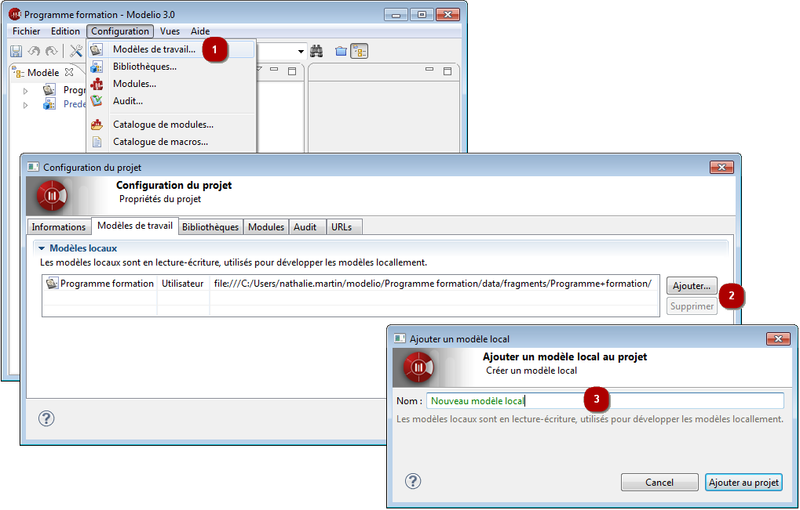

// Disable all captions for figures.
:!figure-caption:

[[Configurer-les-modèles-de-travail-du-projet]]

[[configurer-les-modèles-de-travail-du-projet]]
= Configurer les modèles de travail du projet

Un *modèle de travail* dans un projet Modelio est un modèle modifiable sur lequel travaille un utilisateur final.

Chaque nouveau projet est automatiquement configuré avec au moins un modèle de travail local, qui est typiquement le modèle principal sur lequel vous allez travailler.

Vous pouvez définir d'autres modèles de travail dans votre projet, par exemple, afin de faire des expériences en dehors du modèle principal, ou pour modéliser des tests sans manipuler le modèle principal.

Les modèles de travail sont gérés dans l'onglet *Modèles de travail* de la fenêtre *Configuration du projet*.

.Configuration des modèles de travail d'un projet

*Étapes :*

1.  Cliquez sur "Configuration \ Modèles de travail..." ou sur l'icône [image:images/Modeler-_modeler_managing_projects_configuring_project_work_models_config.png[3]] puis l'onglet "Modèles de travail".
2.  Vous pouvez ajouter de nouveaux modèles locaux à votre projet ou supprimer des modèles locaux existants.
3.  Pour ajouter un nouveau modèle local, cliquez sur le bouton "Ajouter..." puis saisissez un nom pour le modèle de travail. Validez en cliquant sur le bouton "Ajouter au projet".

