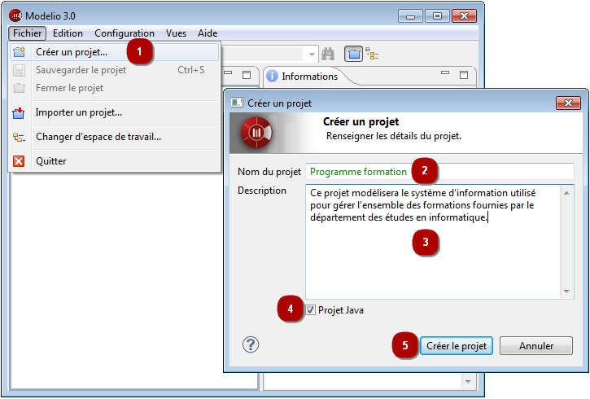

// Disable all captions for figures.
:!figure-caption:
// Path to the stylesheet files
:stylesdir: .

= Créer un projet

.Création d'un nouveau projet

*Étapes :*

1.  Cliquez sur "Fichier \ Créer un projet...".
2.  Saisissez le nom du projet.
3.  Saisissez la description du projet.
4.  Cochez ou décochez la case "Projet Java" pour déployer ou non le module Java Designer dans votre nouveau projet.
5.  Cliquez sur "Créer le projet" pour créer et ouvrir le projet.

*Note :* Le nom de chaque projet doit être unique. Il n'est pas possible de créer deux projets ayant le même nom.

