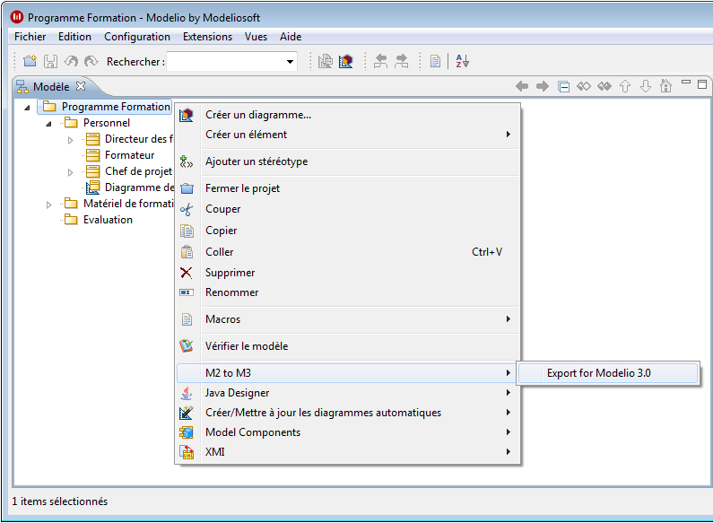
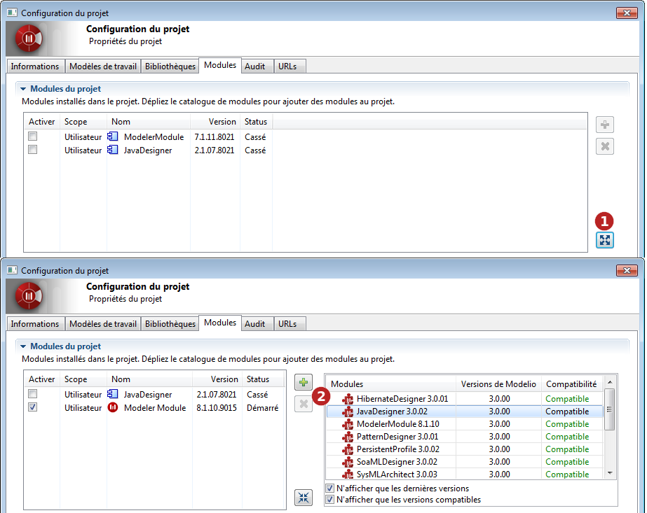

// Disable all captions for figures.
:!figure-caption:
// Path to the stylesheet files
:stylesdir: .

= Migrer des projets de versions antérieures de Modelio

Les projets Modelio 2.2.1 ou 2.2.2 peuvent être migrés vers Modelio 4.

Pour migrer des projets développés avec des versions antérieures à Modelio 2.2.1, il faut d'abord les migrer vers Modelio 2.2.1 en suivant la bonne procédure de migration.

===== Prérequis

* Une installation opérationnelle de Modelio 2.2.1 ou 2.2.2
* Une installation opérationnelle de Modelio 4
* Le module de migration *M2toM3* que vous pouvez télécharger depuis le site https://store.modelio.org/resource/modules/migration-modelio-2-2-1-to-3-0.html[Modelio store].

===== Lancement de la procédure de migration

La capture d'écran ci-dessous montre comment lancer la procédure qui vous permettra de migrer un projet développé avec Modelio 2.2.1 vers Modelio 4.

===== Dans Modelio 2.2.1 ou 2.2.2

1.  Démarrez Modelio 2 et ouvrez le projet à migrer.
2.  Installez le module M2toM3 dans le projet.
3.  Depuis la racine du projet, lancez la commande *"M2 to M3\Export pour Modelio 3"*.
4.  Dans la fenêtre de sélection de fichier, indiquez un chemin et un nom pour le fichier zippé qui contiendra le projet migré.
5.  Lorsque la commande a fini de s'exécuter, le projet migré est disponible dans le fichier (zippé) sélectionné lors de l'étape précédente.
6.  Fermez le projet et quittez Modelio 2, après avoir noté le nom et le chemin du fichier du projet migré.

C'est tout pour Modelio 2 !

===== Dans Modelio 4

1.  Démarrez Modelio 4.
2.  Depuis le menu _Fichier_, lancez la commande *"Importer un projet"*.
3.  Dans la fenêtre de sélection de fichier, indiquez le chemin et le nom du fichier zippé contenant le projet migré.
4.  Lorsque la commande a fini de s'exécuter, le projet migré apparaît dans la liste des projets disponibles dans l'espace de travail.
5.  Ouvrez le projet migré.
6.  Effectuez les dernières opérations décrites ci-dessous.

*Note :* La toute première ouverture d'un projet migré peut durer quelques minutes à cause de la technologie de stockage différente de Modelio 4, qui nécessite l'initialisation du projet migré lors de sa première ouverture.

===== Etapes finales

Le nouveau projet migré dans Modelio 4 doit contenir toutes les données du projet Modelio 2 sans aucune perte. Cependant, il se peut que le projet nouvellement migré référence encore des modules de Modelio 2 qui sont obsolètes.

Ceci est facile à diagnostiquer dans l'onglet *<<Modeler-_modeler_managing_projects_configuring_project_modules.adoc#,Modules>>* de la fenêtre de *configuration du projet* montrée dans la capture d'écran ci-dessous :

Cliquez sur "Configuration\  Modules..." ou sur l'icône image:images/Modeler-_modeler_managing_projects_migration_config.png[1] puis l'onglet "Modules". +
Dans la liste de modules du projet (à gauche), identifiez les modules *cassés*. Ce sont les modules qui ont besoin d'être mis à jour pour Modelio 4.

1.  Cliquez sur image:images/Modeler-_modeler_managing_projects_migration_maximize.png[6] pour ouvrir le catalogue de modules. Le catalogue montre les modules disponibles sur votre poste de travail.
2.  Dans le catalogue de modules, identifiez la nouvelle version des modules qui sont indiqués comme étant _cassés_ dans la liste à gauche. Pour chacun d'entre eux :
1.  Sélectionnez-le.
2.  Cliquez sur  pour l'installer dans le projet.

*Note :* Les modules *Modeling Wizard*, *Analyst*, *Analyst Administrator*, et *Subversion* font maintenant partie intégrante de Modelio, leurs versions obsolètes peuvent donc être simplement retirés du projet (image:images/Modeler-_modeler_managing_projects_migration_delete.png[7]).

