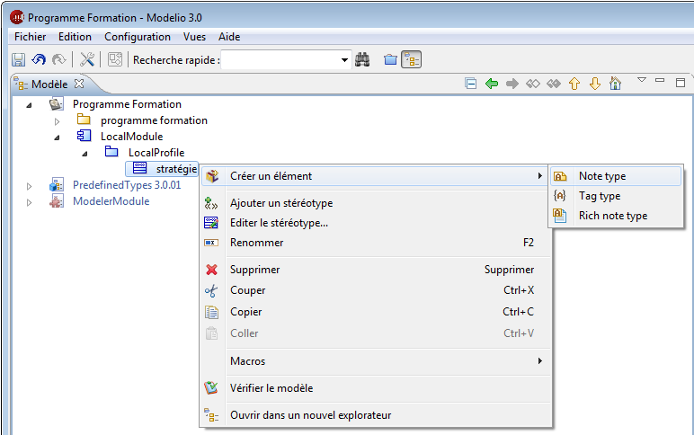

// Disable all captions for figures.
:!figure-caption:
// Path to the stylesheet files
:stylesdir: .

[[Le-niveau-avancé-ndash-Travailler-dans-le-modèle-MDA]]

[[le-niveau-avancé-travailler-dans-le-modèle-mda]]
= Le niveau avancé – Travailler dans le modèle MDA

[[Afficher-le-modèle-MDA]]

[[afficher-le-modèle-mda]]
===== Afficher le modèle MDA

.Affichage du modèle MDA
 image::images/Modeler-_modeler_mda_services_advanced_ShowMDA-fr.png[2]

*Étapes :*

1. Ouvrez le menu "Options d'affichage".
2. Sélectionnez l'option "Afficher le modèle MDA".
3. Tous les modules déployés apparaissent ici, de même que "LocalModule" dans lequel vous pouvez créer de nouveaux éléments MDA.

[[Créer-un-élément-MDA]]

[[créer-un-élément-mda]]
===== Créer un élément MDA

Dans le modèle MDA, vous pouvez créer les éléments MDA suivants :

* Sous un module, vous pouvez créer un profil.
* Sous un profil, vous pouvez créer un stéréotype.
* Sous un stéréotype, vous pouvez créer un type de note ou un type de tagged value.

La procédure de création d'un élément MDA est identique à celle utilisée pour créer un élément de modèle : il suffit de cliquer-droit sur un élément pour ouvrir son menu contextuel puis de cliquer sur "Créer un élément" et de sélectionner le type d'élément que vous souhaitez créer. Le nouvel élément est alors immédiatement disponible dans les vues de modélisation de Modelio.

L'exemple ci-dessous montre la création d'un type de note sous un stéréotype.

.Création d'un type de note sous un stéréotype créé auparavant

