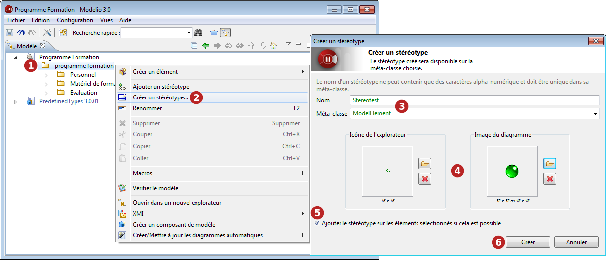

// Disable all captions for figures.
:!figure-caption:
// Path to the stylesheet files
:stylesdir: .

= Le niveau basique – Création d'un stéréotype

.Création d'un nouveau stéréotype

*Étapes :*

1. Dans la vue "Modèle", sélectionnez l'élément pour lequel vous voulez créer un nouveau stéréotype.
2. Lancez la commande "Extensions \ Créer un stéréotype...".
3. Saisissez un nom pour votre nouveau stérérotype, et indiquez la méta-classe à laquelle il va s'appliquer.
4. Sélectionnez les images qui vont représenter le stéréotype dans les explorateurs et les diagrammes.
5. Si vous souhaitez appliquer immédiatement le nouveau stéréotype à l'élément sélectionné, cochez cette case.
6. Terminez en cliquant sur "Créer".

Si vous avez coché la case "Ajouter le stéréotype sur les éléments sélectionnés si cela est possible", le nouveau stéréotype est alors immédiatement ajouté aux éléments sélectionnés dans la vue "Modèle".

*Note :* Les stéréotypes que vous créez sont situés dans le module "Local module".

