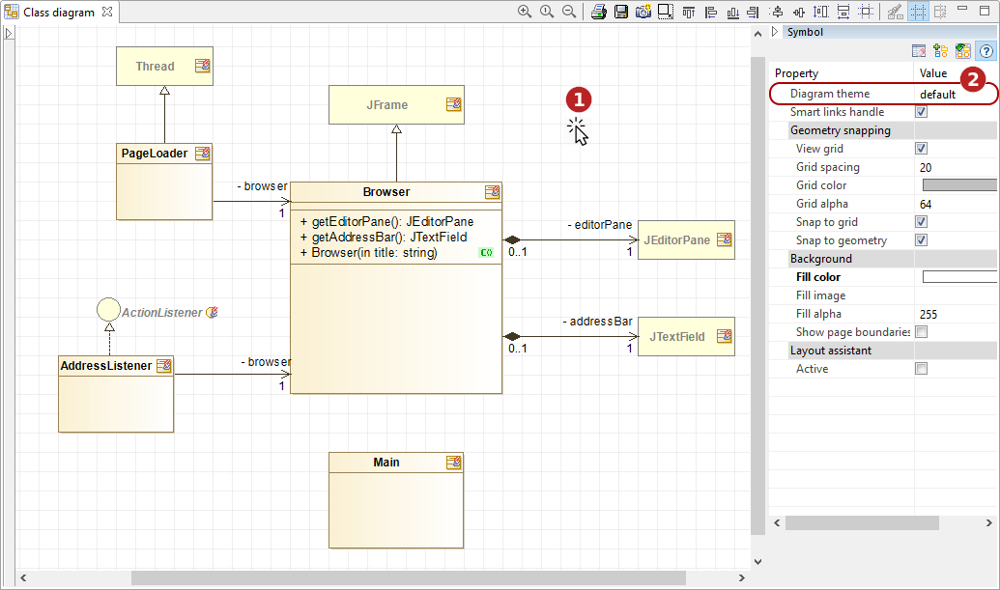
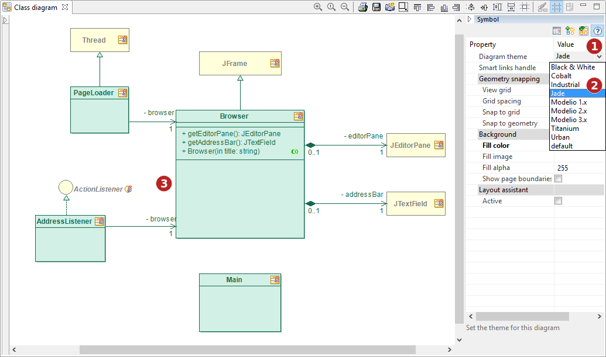
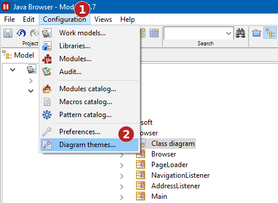
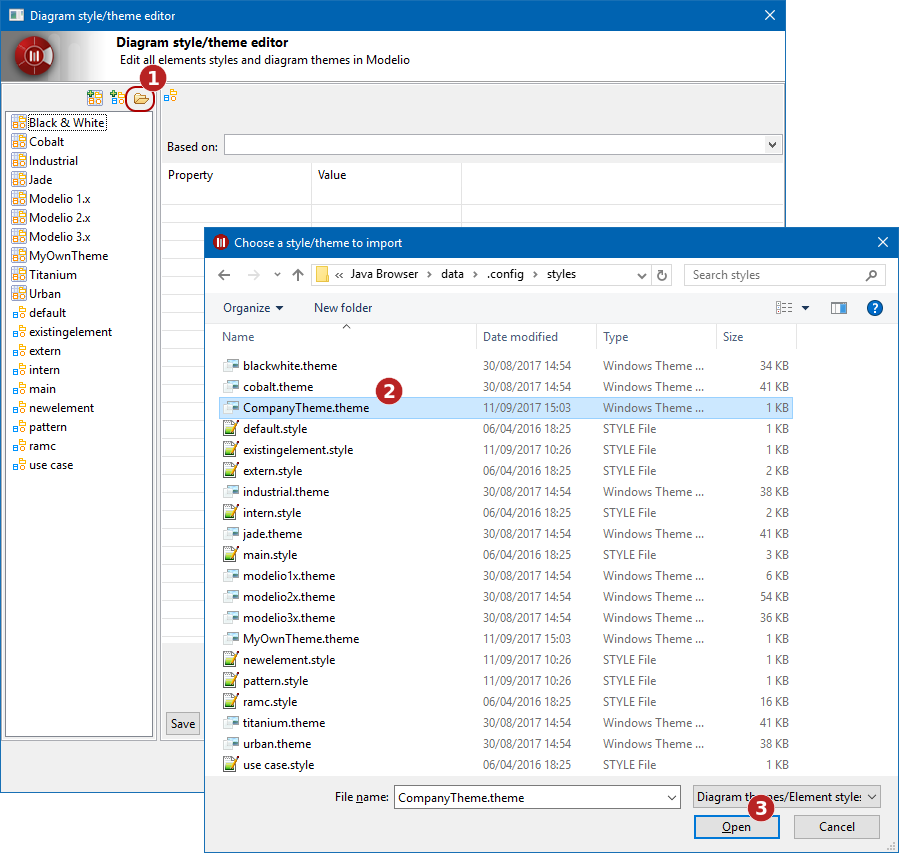
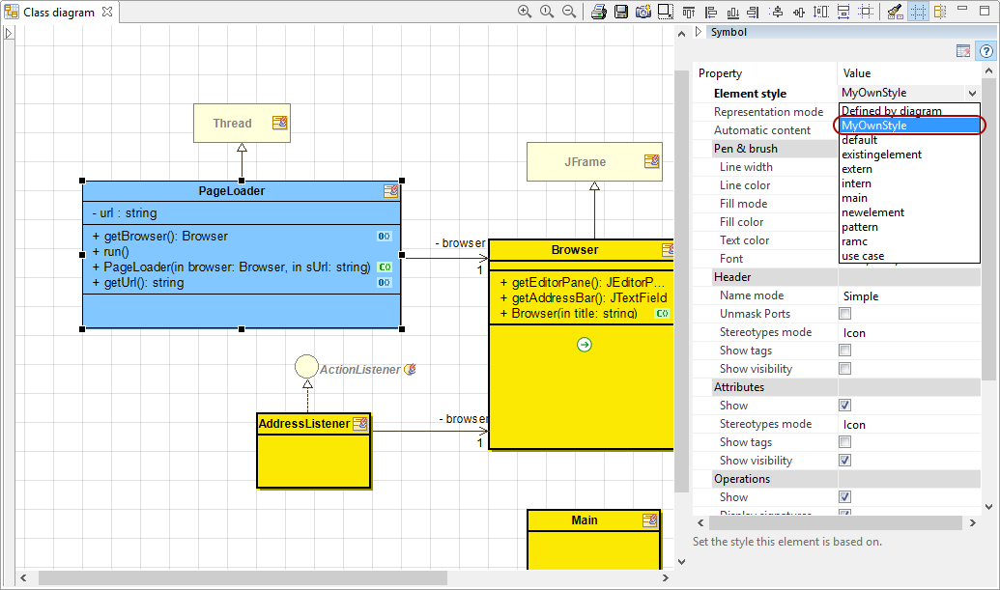
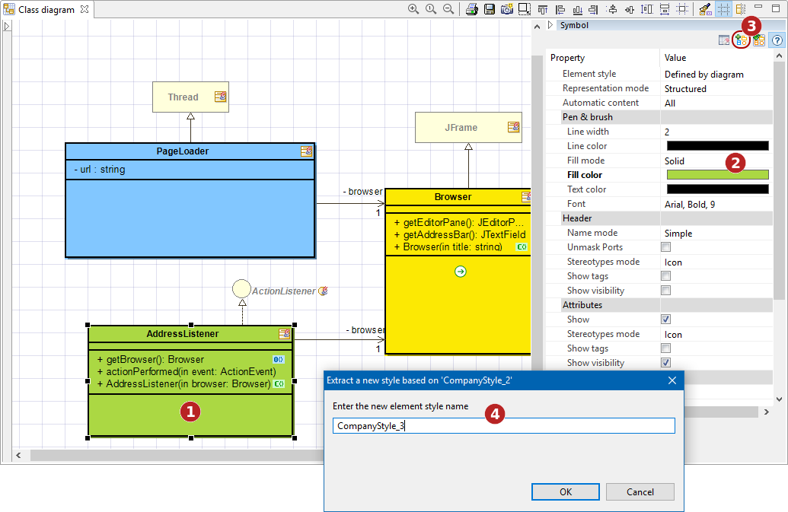
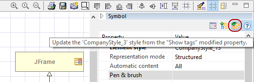

// Disable all captions for figures.
:!figure-caption:
// Path to the stylesheet files
:stylesdir: .

= Styles & thèmes de diagrammes

L'apparence graphique des éléments d'un diagramme est définie dans un thème de diagramme ou dans un style d'élément. +
Un thème de diagramme est un ensemble de propriétés graphiques appliquées à tout un diagramme. +
Un style d'élément est un ensemble de propriétés graphiques appliquées à un élément de diagramme, indépendamment du thème du diagramme.

Modelio fournit un catalogue de thèmes de diagrammes. +
Le thème d'un diagramme est indiqué dans la vue Symbole : +

.Le sélecteur de thèmes de diagramme

*Étapes :*

1. Cliquer sur le fond du diagramme 
2. Le thème du diagramme est indiqué dans la vue Symbole 
 

Pour changer le thème graphique d'un diagramme, il suffit de cliquer sur le sélecteur de thèmes dans la vue Symbole, et de choisir un thème dans la liste déroulante : +

.Sélection d'un thème de diagramme

*Étapes :*

1. Cliquer sur le sélecteur de thèmes
2. Choisir un thème dans la liste déroulante
3. Le thème est appliqué au diagramme

Indépendamment du thème du diagramme, un élément peut avoir son propre style graphique. +
Par défaut, le style d'un élément est "Defini par le diagramme": 

.Le sélecteur de style d'élément
image::images/Modeler-_modeler_modelio_settings_diagram_styles_themes_styles_003.png[image]

*Étapes :*

1. Sélectionner un élément de diagramme
2. Le style de l'élément est indiqué dans la vue Symbole

Pour modifier le style graphique d'un élément, il suffit de cliquer sur le sélecteur de styles dans la vue Symbole, et de choisir un style dans la liste déroulante : +

.Sélection d'un style d'élément
image::images/Modeler-_modeler_modelio_settings_diagram_styles_themes_styles_004.png[image]

*Étapes :*
      
1. Cliquer sur le sélecteur de styles
2. Choisir un style dans la liste déroulante
3. Le style est appliqué à l'élément

===== Thèmes de diagramme personnalisés

Modelio offre également la possibilité de créer ses propres thèmes de diagrame. Pour cela, il faut utiliser l'éditeur de thèmes de diagrammes/styles d'éléments :

.Ouverture de l'éditeur de thèmes de diagrammes/styles d'éléments

*Étapes :* 

1. Dans la barre des menus, cliquer sur 'Configuration' 
2. Dans le menu déroulant, cliquer sur 'Thèmes de diagrammes...'
 

Création d'un thème dans l'éditeur de thèmes de diagrammes/styles d'éléments :

.Création d'un thème de diagramme
image::images/Modeler-_modeler_modelio_settings_diagram_styles_themes_styles_006.png[image]

*Étapes :*

1. Cliquer sur le bouton 'Créer un nouveau thème de diagramme' image:images/Modeler-_modeler_modelio_settings_diagram_styles_new_theme_button.png[image]
2. Nommer le nouveau thème

 

Paramétrage du nouveau thème :

.Paramétrage d'un thème de diagramme
image::images/Modeler-_modeler_modelio_settings_diagram_styles_themes_styles_007.png[image]

*Étapes :*

1. Sélectionner le thème dans la liste
2. Choisir les propriétés à paramétrer
3. Modifier les valeurs despropriétés
4. Sauvegarder le thème
5. Fermer l'éditeur de thèmes de diagrammes/styles d'éléments

Application d'un nouveau thème de diagramme :

.Application d'un nouveau thème sur un diagramme
image::images/Modeler-_modeler_modelio_settings_diagram_styles_themes_styles_008.png[image]

*Étapes :*

1. Cliquer sur le sélecteur de thèmes
2. Choisir le nouveau thème dans la liste déroulante
3. Le thème est appliqué au diagramme

 

*Note*: La même procédure peut être utilisée pour éditer et modifier les thèmes du catalogue de Modelio.

===== Importer un thème

Modelio permet d'importer des thèmes externes. Ces thèmes peuvent ensuite être utilisés tels quels, ou personnalisés dans l'éditeur de thèmes de diagrammes/styles d'éléments.

.Importer un thème de diagramme

*Étapes :*
      
1. Dans l'éditeur de thèmes de diagrammes/styles d'éléments, cliquer surle bouton 'Importer un thème de diagramme/style d'élément' 
2. Sélectionner le thème à importer 
3. Cliquer sur le bouton 'Ouvrir' 

 

===== Création de style d'élément

Il existe deux méthodes pour créer des styles d'élément : l'éditeur de thèmes de diagrammes/styles d'éléments, et la vue Symbole d'un diagramme.

*Création d'un style d'élément avec l'éditeur de thèmes de diagrammes/styles d'éléments* +
Pour créer un style d'élément avec l'éditeur de thèmes de diagrammes/styles d'éléments, il faut cliquer sur le bouton 'Créer un nouveau style d'élément' image:images/Modeler-_modeler_modelio_settings_diagram_styles_new_style_button.png[image], puis nommer le nouveau style et le paramétrer :

.Paramétrage d'un nouveau style d'élément
image::images/Modeler-_modeler_modelio_settings_diagram_styles_themes_styles_010.png[image]

*Étapes :* 

1. Sélectionner le style dans la liste
2. Choisir les propriétés à paramétrer
3. Modifier la valeur des propriétés
4. Sauvegarder le style
5. Fermer l'éditeur de thèmes de diagrammes/styles d'éléments

Le nouveau style est disponible dans la vue Symbole et peut être appliqué sur les éléments correspondants :

.Le nouveau style dans le sélecteur de styles d'élément

*Créer un style d'élément depuis la vue Symbole*

Lorsque les propriétés graphiques d'un élément sont modifiées dans la vue Symbole, elles peuvent être enregistrées en tant que style d'élément : 

.Création d'un nouveau style à partir de propriétés graphiques modifiées

*Étapes :*

1. Sélectionner un élément dans un diagramme 
2. Modifier les propriétés graphiques dans la vue Symbole 
3. Cliquer sur le bouton 'Créer un nouveau style' image:images/Modeler-_modeler_modelio_settings_diagram_styles_new_style_button.png[image]
4. Nommer le nouveau style

Le nouveau style est est disponible dans la vue Symbole et peut être appliqué aux éléments correspondants : +

.Un nouveau style d'élément dans le sélecteur de styles
image::images/Modeler-_modeler_modelio_settings_diagram_styles_themes_styles_013.png[image]

*Note :* Le thème du diagramme courant peut être mis à jour à partir de modifications effectuées dans la vue Symbole. Pour cela, une fois les modifications effectuées, il faut cliquer sur le bouton 'Mettre à jour le thème de diagramme' :

.Mise à jour du thème de diagramme depuis la vue Symbole

