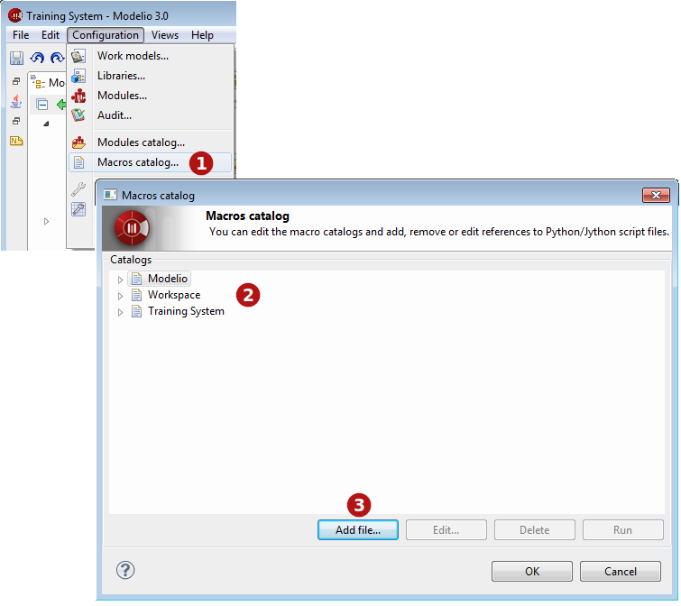

// Disable all captions for figures.
:!figure-caption:

= Le catalogue de macros

[[Introduction-au-catalogue-de-macros-Modelio]]

[[introduction-au-catalogue-de-macros-modelio]]
===== Introduction au catalogue de macros Modelio

Les macros Modelio sont des scripts Jython sauvegardés en tant que fichiers, accessible à travers l'interface Modelio. Les macros ont un nom et peuvent avoir une icône associée dans l'IHM Modelio.

Le catalogue de macros Modelio organise et affiche toutes les macros disponibles, et indique le niveau auquel chaque macro peut être exécutée :

* Modelio : La macro est disponible dans tous les projets dans tous les espaces de travail Modelio.
* Espace de travail : La macro est disponible dans tous les projet dans l'espace de travail Modelio courant.
* Projet : La macro n'est disponible que dans le projet courant.

[[Créer-une-nouvelle-macro]]

[[créer-une-nouvelle-macro]]
===== Créer une nouvelle macro

Si vous avez l'intention d'utiliser un script Jython plusieurs fois, il peut vous être utile d'en créer une nouvelle macro, comme le montrent les captures d'écran ci-dessous.

.Ouverture du catalogue de macros et ajout d'une macro
image::images/Modeler-_modeler_modelio_settings_macros_catalog_scripts5.png[6]

*Légende :*

1. Ouvrez le catalogue de macros en utilisant la commande "Configuration / Catalogue de macros".
2. Sélectionnez le niveau auquel la macro sera disponible (Modelio, espace de travail courant ou projet courant).
3. Cliquez sur *Ajouter fichier...*.
4. Saisissez un nom pour la macro. Ce nom apparaîtra dans le menu contextuel.
5. Sélectionnez le fichier script que vous souhaitez y associer. Pour de plus amples informations sur la sauvegarde des fichiers script, voir la section sur les <<Modeler-_modeler_handy_tools_scripts_macros.adoc#,scripts>>.
6. Sélectionnez une icône qui va représenter la nouvelle macro dans la barre d'outils de Modelio.
7. Saisissez une description pour la nouvelle macro.
8. Cliquez dans la zone *"Applicable sur"* afin d'ouvrir la fenêtre de sélection des méta-classes.
9. Ajoutez la méta-classe sur laquelle la macro pourra s'exécuter.
10. Cliquez sur "OK" pour valider.
11. Utilisez ces cases à cocher pour indiquer depuis endroit vous pourrez lancer la macro. La case à cocher *Montrer dans le menu contextuel* affichera la macro dans le menu contextuel, et la case à cocher *Montrer dans la barre d'outils* affichera l'icône associée dans la barre d'outils de Modelio. Vous pouvez activer les deux options.
12. Cliquez sur "OK" pour valider.

[[Exécuter-une-macro]]

[[exécuter-une-macro]]
===== Exécuter une macro

Pour lancer une macro, utilisez les icônes associées ou les commandes dans le menu contextuel "Macros", si ces dernières ont été définies.

Vous pouvez également exécuter des macros depuis la fenêtre "Catalogue de macros" (accessible via la commande "Configuration / Catalogue de macros"). Dans cette fenêtre, il suffit de sélectionner la macro que vous souhaitez exécuter et de cliquer sur "Lancer".

