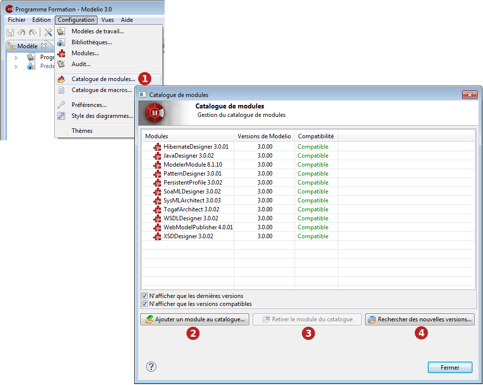

// Disable all captions for figures.
:!figure-caption:
// Path to the stylesheet files
:stylesdir: .

= Le catalogue de modules Modelio

===== Présentation du catalogue de modules Modelio

Le catalogue de modules Modelio est une liste de tous les modules Modelio connus par votre installation locale de Modelio. Par défaut, les modules figurant dans le catalogue de modules sont ceux fournis avec votre installation Modelio, mais vous pouvez également y rajouter d'autres modules que vous avez téléchargés ou créés vous-même, afin de pouvoir les utiliser dans les projets Modelio.

*Note :* L'ajout d'un module Modelio au catalogue de modules ne le sélectionne pas automatiquement dans votre projet Modelio courant. Chaque module que vous souhaitez utiliser dans un projet doit être sélectionné à l'aide de la commande de menu contextuel "Configuration / Modules...".

Les trois colonnes principales dans la fenêtre "Catalogue de modules" affichent les informations suivantes :

* La colonne *Modules* affiche le nom et le numéro de version du module.
* La colonne *Versions de Modelio* indique la version de Modelio requise par le module.
* La colonne *Compatibilité* indique si le module est compatible avec la version courante de Modelio. +
Il existe quatre valeurs possibles pour ce champ :
** *_Compatible_*, qui indique que la compatibilité du module est certifiée.
** *_Mise à jour recommandée_*, qui indique que le module devrait fonctionner correctement mais qu'il se peut qu'une version plus récente soit disponible.
** *_Incompatible : Mise à jour de Modelio requise_*, qui indique que le module nécessite une version plus récente de Modelio que celle que vous utilisez actuellement.
** *_Incompatible : Mise à jour du module requise_*, qui indique que le module fonctionne avec les versions antérieures de Modelio et ne fonctionnera pas avec celle que vous utilisez actuellement.

La case à cocher *N'afficher que les dernières versions* est utile lorsque plusieurs versions d'un module donné sont connues par votre installation Modelio. Cochez cette case, afin d'éviter de lister toutes les versions d'un module.

De même, la case à cocher *N'afficher que les versions compatibles* vous permet de n'afficher que la liste de modules qui sont compatibles avec votre version courante de Modelio.

===== Ajouter ou retirer un module du catalogue de modules

Si vous souhaitez ajouter un module au catalogue de modules ou bien en retirer un, il suffit d'utiliser les boutons "Ajouter un module au catalogue..." et "Retirer le module du catalogue".

.Le catalogue de modules Modelio

*Légende :*

1.  Lancez la commande *Configuration / image:images/Modeler-_modeler_modelio_settings_modules_catalog_modulecatalog.png[2] Catalogue de modules...*.
2.  Pour ajouter un module, cliquez sur *Ajouter un module au catalogue...* et utilisez l'explorateur de fichiers afin de sélectionner les modules (fichiers *.jmdac) que vous souhaitez ajouter.
3.  Pour retirer un module, sélectionnez le module en question et cliquer sur le bouton *Retirer le module du catalogue*.
4.  Pour télécharger des nouvelles versons des modules dans le catalogue, cliquez sur *Rechercher des nouvelles versions...*

