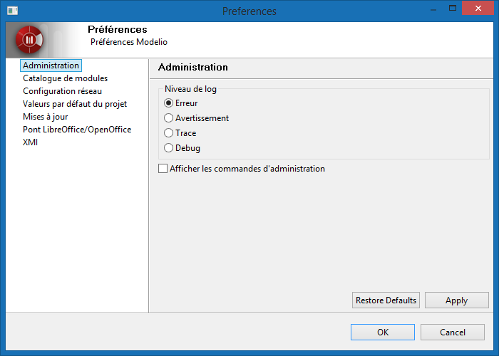
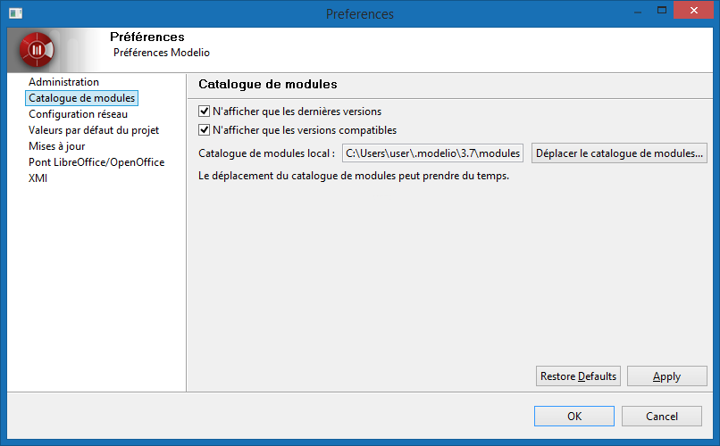
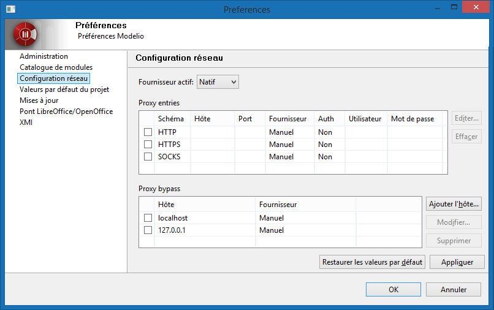
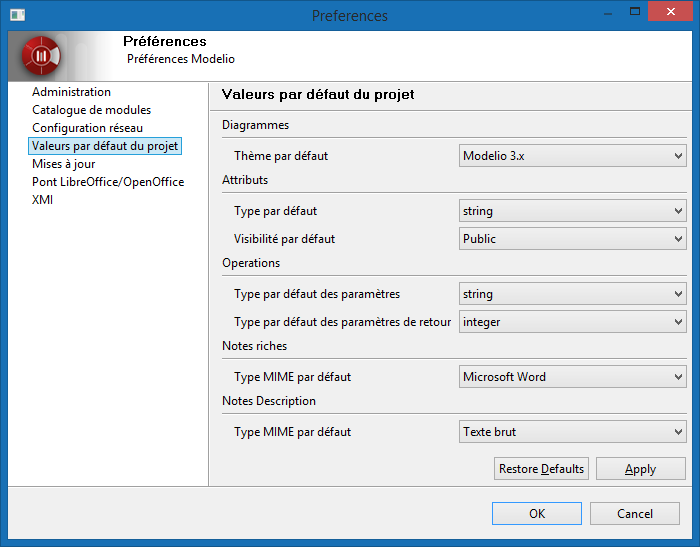
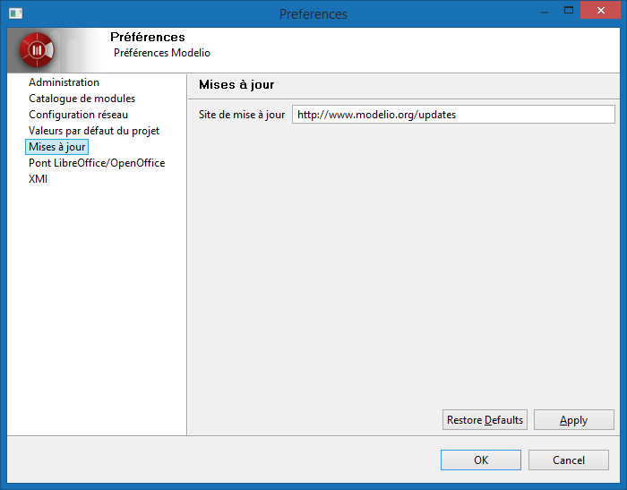
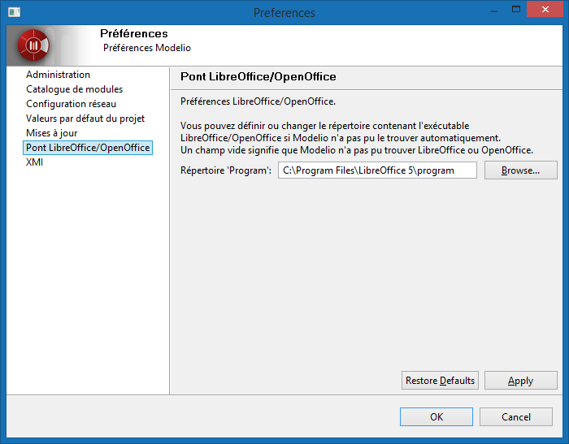
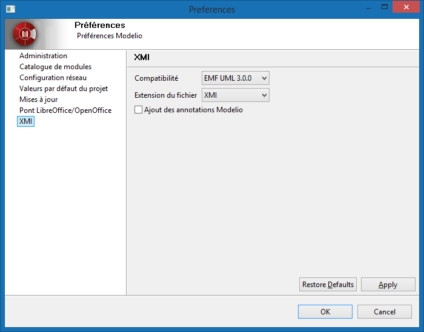

// Disable all captions for figures.
:!figure-caption:
// Path to the stylesheet files
:stylesdir: .

= Préférences Modelio

===== Administration

Dans la catégorie *Administration* de la fenêtre *Préférences*, vous avez la possibilité de définir le niveau de log de Modelio et d'activer les commandes d'administration.

*Définir le niveau de log de Modelio* +
Par défaut, le niveau de log est défini à *Erreur*, signifiant que seules les erreurs sont enregistrées. Nous recommandons l'utilisation de cette option, afin de préserver la performance de l'application et d'éviter la production de fichiers log énormes. +
L'utilisation des niveaux *Avertissement*, *Trace* et *Debug* plus verbeux n'est indiquée qu'en cas de problèmes.

*Activer les commandes d'administration* +
Ces commandes sont disponibles dans le menu contextuel de la racine d'un modèle. Les commandes d'administration sont :

* *Déployer un module directement depuis un fichier jmdac...* : Déploie un module dans le projet courant depuis l'archive jmdac du module. Le module déployé sera enregistré dans le catalogue de modules.
* *Défragmenter le modèle local* : Les liens d'impact et autres données locales sont stockés dans le "modèle local". Au fil des sauvegardes du projet, le "modèle local" se fragmente de plus en plus, occupant ainsi de plus en plus d'espace disque et augmentant le temps de sauvegarde. La défragmentation permet de réduire l'espace disque occupé et le temps de sauvegarde.
* *Reconstruire les index* : Les index du modèle permettent à Modelio de rechercher rapidement un élément du modèle. S'il y a des éléments "_shell_" dans le modèle, il se peut que la reconstruction des index corrige cela. Après la reconstruction des index, le projet doit être fermé et ré-ouvert pour que les nouveaux index soient pris en compte.
* *Défragmenter les index* : La taille des index augmentent à chaque sauvegarde occupant de plus en plus d'espace disque, ainsi que le temps de la sauvegarde du projet. La défragmentation des index permet de réduire leurs tailles ainsi que le temps de sauvegarde du projet.

===== Catalogue de modules

Le catalogue de modules est la liste de tous les modules connus par votre installation locale de Modelio. Par défaut, les modules figurant dans le catalogue de modules sont ceux fournis avec votre installation Modelio, mais vous pouvez également y rajouter d'autres modules que vous avez téléchargés ou créés vous-même, afin de pouvoir les utiliser dans les projets Modelio.

Les 2 options suivantes sont les options par défaut lors de l'ouverture du catalogue de modules :

* *N'afficher que les dernières versions* : Si plusieurs versions d'un même module existent dans le catalogue, cette option permet de n'afficher que la dernière version.
* *N'afficher que les versions compatibles* : Seuls les modules compatibles avec la version actuelle de Modelio seront affichés.

Par défaut, le catalogue est stocké dans l'espace utilisateur :

* Sous Windows, c'est dans le répertoire `%USERPROFILE%\.modelio\4.1\modules`
* Sous Linux et Mac OSX, c'est dans le répertoire `${HOME}/.modelio/4.1/modules`

Vous pouvez choisir un autre emplacement pour le catalogue de modules. Pour cela, cliquez sur le bouton "Déplacer le catalogue de modules..." et choisissez un autre emplacement. Le contenu du catalogue sera alors déplacé vers ce nouvel emplacement. Veuillez noter que cette opération peut prendre plusieurs minutes en fonction de la taille du catalogue et de la performance de votre ordinateur.

===== Configuration réseau

Dans la catégorie *Configuration réseau* de la fenêtre *Préférences*, vous avez la possibilité de configurer la connexion à un serveur proxy.

Dans "*Fournisseur actif*", vous pouvez choisir :

* *Direct* : Sélectionnez "Direct", si vous n'avez pas besoin de passer par un proxy pour accéder aux réseaux.
* *Manuel* : Sélectionnez "Manuel", si vous avez besoin de définir manuellement les paramétrages.
* *Natif* : Sélectionnez "Natif", si vous voulez utiliser le paramétrage du système d'exploitation.

*Proxy entries* +
La table affiche les entrées qui sont disponibles pour tous les "Fournisseurs". La case à cocher de la 1ère colonne indique que l'entrée est utilisée par le "Fournisseur" actuellement sélectionné.

Si vous avez sélectionné "Manuel" comme "fournisseur actif", il y a 3 schémas prédéfinis pour configurer: HTTP, HTTPS and SOCKS. La configuration de chaque schéma est affichée dans la table "Proxy entries". Pour éditer la configuration d'un schéma, double-cliquez sur l'entrée ou sélectionnez l'entrée et cliquez sur le bouton "Editer...". Si le champ "Port" est vide, ce sera le numéro du port par défaut qui sera utilisé. +
Les numéros des ports par défaut pour chaque schémas prédéfinis sont :

* HTTP : 80
* SSL : 443
* SOCKS : 1080

*Proxy bypass*

Utilisez cette table pour spécifier les noms d'hôtes avec lesquels il ne faut pas utiliser le proxy. Une connexion directe sera toujours utilisée pour trouver les hôtes.

La case à cocher de la 1ère colonne indique que l'entrée est utilisée par le "Fournisseur" actuellement sélectionné.

===== Valeurs par défaut du projet

Dans la catégorie *Valeurs par défaut du projet* de la fenêtre *Préférences*, vous avez la possibilité de définir les valeurs par défaut lors de la création de nouveaux éléments.

* *Diagrammes* : Définit le thème utilisé lors de la création de nouveaux diagrammes.
* *Attributs* : Définit le type et la visibilité lors de la création d'attributs.
* *Operations* : Définit le type des paramètres et le type de retour de l'opération.
* *Notes riches* : Définit le type MIME pour les notes riches créées via l'éditeur tabulaire.
* *Notes Description* : Définit le type MIME (texte brut ou HTML) pour les notes "Description"

===== Mises à jour

Le "site de Mise à jour" contient les mises à jour de l'application Modelio, des modules et des composants de modèles. +
Par défaut, l'URL pointe sur le site officiel de la mise à jour de Modelio.

===== Pont LibreOffice / OpenOffice

Dans la catégorie *Pont LibreOffice / OpenOffice* de la fenêtre *Préférences*, vous avez la possibilité de définir le chemin vers le répertoire contenant l'exécutable LibreOffice ou OpenOffice, au cas où Modelio n'arrive pas à le trouver automatiquement, ou si vous souhaitez utiliser l'une de ces applications plutôt que l'autre.

===== XMI

Dans la catégorie *XMI* de la fenêtre *Préférences*, vous avez la possibilité de définir plusieurs options pour vos opérations d'import / d'export XMI.

* *Compatibilité* : Choisir entre un fichier compatible avec la spécification EMF 3.0.0 ou les spécifications UML 2.1.1, UML 2.2, UML 2.3 ou UML 2.4.1 de l'OMG.
* *Extension du fichier* : Préciser l'extension qui sera donnée aux fichiers exportés (".xmi" ou ".uml")
* *Ajout des annotations Modelio* : Définir si la compatibilité maximum est activée lors de l'exécution d'une opération de ré-import dans Modelio.

