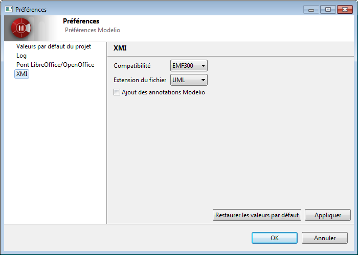

// Disable all captions for figures.
:!figure-caption:

[[Les-préférences-de-limport-export-XMI-de-Modelio]]

[[les-préférences-de-limport-export-xmi-de-modelio]]
= Les préférences de l'import / export XMI de Modelio

[[Configuration-de-limport-export-XMI]]

[[configuration-de-limport-export-xmi]]
===== Configuration de l'import / export XMI

Vous pouvez modifier le comportement du générateur en définissant les préférences pour le service d'import / export XMI de Modelio.

[[Les-préférences-XMI]]

[[les-préférences-xmi]]
===== Les préférences XMI

Les préférences XMI

[cols=",",options="header",]
|===========================================================================================================================================================
|*Préférence* |*Permet de...*
|Compatibilité |Choisir entre un fichier compatible avec la spécification EMF 3.0.0 ou les spécifications UML 2.1.1, UML 2.2, UML 2.3 ou UML 2.4.1 de l'OMG.
|Extension du fichier |Préciser l'extension qui sera donnée aux fichiers exportés (".xmi" ou ".uml").
|Ajout des annotations Modelio |Définir si la compatibilité maximum est activée lors de l'exécution d'une opération de ré-import dans Modelio.
|===========================================================================================================================================================

