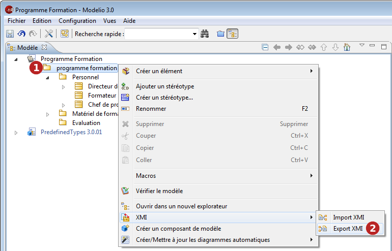
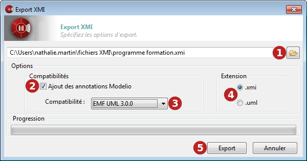

// Disable all captions for figures.
:!figure-caption:
// Path to the stylesheet files
:stylesdir: .

= Exporter un modèle au format XMI

===== Introduction

L'opération d'export XMI de Modelio lance la génération de fichiers XMI à partir de modèles construits dans Modelio.

La commande "Export XMI" ne peut être lancée qu'à partir d'un package.

.La commande d'export XMI

*Étapes :*

1. Cliquez droit sur un package pour ouvrir son menu contextuel.
2. Lancez la commande "Import/Export \ Export \ Export XMI".

===== La fenêtre d'export XMI

.La fenêtre d'export XMI

*Étapes :*

1. Dans ce champ, sélectionnez le chemin du fichier (existant ou non) vers lequel vous souhaitez exporter.
2. Lorsque l'option "Ajout des annotations Modelio" est active, davantage d'informations seront exportées, assurant le maximum de compatibilité en cas de ré-import dans Modelio. Certaines informations disponibles dans Modelio mais absentes en UML2 pourront ainsi être rapatriées.
3. Dans le champ "Compatibilité", sélectionnez un format pour l'opération d'export. Choisissez entre UML2.1.1, UML2.2, UML2.3, UML2.4.1 et EMF210.
4. Dans le champ "Extension", définissez l'extension qui sera affectée au fichier que vous allez exporter (".xmi" ou ".uml").
5. Cliquez sur "Export".

===== Export partiel

Avec Modelio XMI Import/Export, vous avez la possibilité d'effectuer un import XMI partiel. Pour ce faire, il suffit de lancer la commande d'export de n'importe quel package de votre projet.

La portée de l'export sera alors limitée aux sous-éléments du package à partir duquel la commande a été lancée. Les éventuels liens qui pointent en dehors de ce namespace seront perdus.

