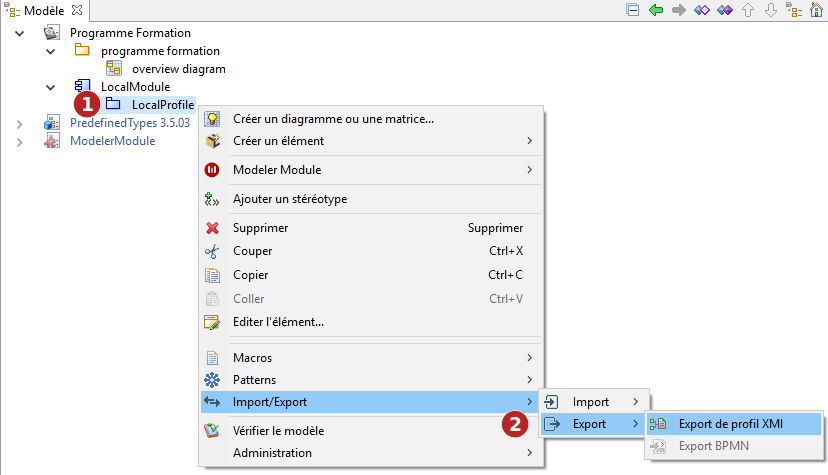
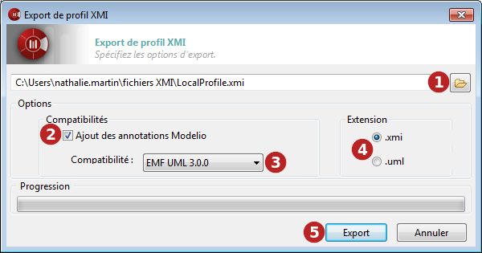

// Disable all captions for figures.
:!figure-caption:
// Path to the stylesheet files
:stylesdir: .

= Exporter un profil au format XMI

===== Introduction

L'opération d'export de profils de Modelio lance la génération de fichiers XMI à partir d'un profil construit dans Modelio.

La commande "Export de profil" ne peut être lancée qu'à partir d'un profil.

.La commande d'export de profil XMI

*Étapes :*

1. Cliquez droit sur un profil pour ouvrir son menu contextuel.
2. Lancez la commande "Import/Export \ Export \ Export de profil" command.

===== La fenêtre "Export de profil XMI"

.La fenêtre "Export de profil XMI"

*Étapes :*

1. Dans ce champ, sélectionnez le chemin du fichier (existant ou non) vers lequel vous souhaitez exporter.
2. Lorsque l'option "Ajout des annotations Modelio" est active, davantage d'informations seront exportées, assurant le maximum de compatibilité en cas de ré-import dans Modelio. Certaines informations disponibles dans Modelio mais absentes en UML2 pourront ainsi être rapatriées.
3. Dans le champ "Compatibilité", sélectionnez un format pour l'export. Choisissez entre UML2.1.1, UML2.2, UML2.3, UML2.4.1 et EMF210.
4. Dans le champ "Extension", définissez l'extension qui sera affectée au fichier que vous allez exporter (".xmi" ou ".uml").
5. Cliquez sur "Export".

