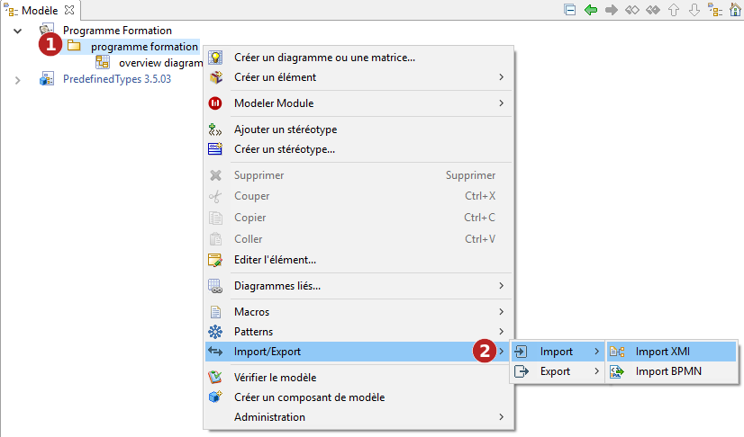
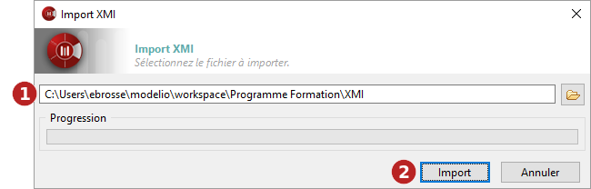

// Disable all captions for figures.
:!figure-caption:
// Path to the stylesheet files
:stylesdir: .

= Importer un modèle au format XMI

[[Introduction]]

[[introduction]]
===== Introduction

L'opération d'import XMI de Modelio importe un modèle UML2 dans Modelio à partir d'un fichier XMI.

La commande "Import XMI" ne peut être lancée qu'à partir des packages. Les éléments importés seront placés dans le package sélectionné.

.La commande d'import XMI

*Étapes :*

1. Cliquez droit sur un package pour ouvrir le menu contextuel.
2. Lancez la commande "Import/Export \ Import \ Import XMI".

[[La-fenêtre-dimport-XMI]]

[[la-fenêtre-dimport-xmi]]
===== La fenêtre d'import XMI

.La fenêtre d'import XMI

*Étapes :*

1. Sélectionnez le chemin vers le fichier XMI que vous souhaitez importer.
2. Cliquez sur "Import".

