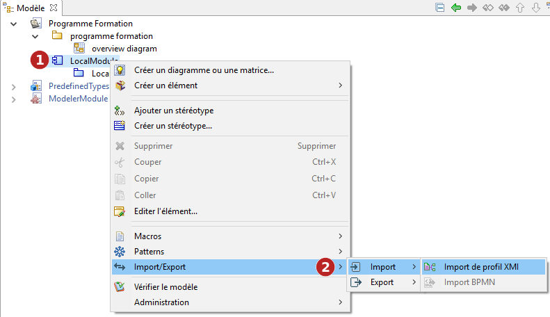
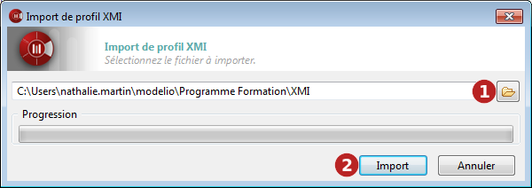

// Disable all captions for figures.
:!figure-caption:
// Path to the stylesheet files
:stylesdir: .

= Importer un profil au format XMI

===== Introduction

L'opération d'import de profil de Modelio importe un profil UML2 dans Modelio à partir d'un fichier XMI.

La commande "Import de profil" ne peut être lancée que sur les modules. Les éléments importés seront placés dans le module sélectionné.

.La commande d'import de profil XMI

*Étapes :*

1. Cliquez droit sur un module pour ouvrir le menu contextuel.
2. Lancez la commande "Import/Export \ Import \ Import de profil".

===== La fenêtre d'import de profil XMI

.La fenêtre d'import de profil XMI

*Étapes :*

1. Sélectionnez le chemin du fichier XMI que vous souhaitez importer.

2. Cliquez sur "Import".

