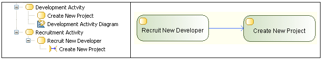

// Disable all captions for figures.
:!figure-caption:
// Path to the stylesheet files
:stylesdir: .

[[R1030]]

[[r1030]]
= R1030

[[Résumé]]

[[résumé]]
===== Résumé

La source et la cible d'un _ActivityEdge_ doivent être contenues dans la même _Activity_.

[[Détails]]

[[détails]]
===== Détails

Dans cet exemple, le _ControlFlow_ est invalide car sa source est contenue dans l'_Activity_ " Recruitment ", tandis que sa cible est contenue dans l'_Activity_ " Developement ".

[[Conseils]]

[[conseils]]
===== Conseils

Si vous rencontrez une erreur R1030, vous pouvez la corriger en :

* déplaçant l'une des extrémités de l'_ActivityEdge_ concerné vers un élément contenu dans la même _Activity_ que l'autre extrémité
* déplaçant la source de l'_ActivityEdge_ concerné dans la même _Activity_ que la cible ou inversement

Vous pouvez également utiliser un noeud de type _CallBehaviorAction_ pour référencer un _Behavior_ (c'est-à-dire une _Activity_, une _Interaction_ ou une _CommunicationInteraction_) depuis une autre _Activity._

