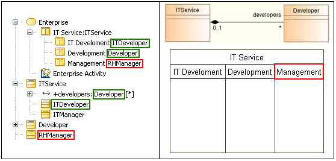

// Disable all captions for figures.
:!figure-caption:

[[R1090]]

[[r1090]]
= R1090

[[Résumé]]

[[résumé]]
===== Résumé

Un _Classifier_ représenté par une sous-_ActivityPartition_ doit appartenir ou être au bout d'une association de composition du _Classifier_ représenté par la super _ActivityPartition_.

[[Détails]]

[[détails]]
===== Détails

Si une _ActivityPartition_ non externe représente un _Classifier_ et est contenue dans une autre _ActivityPartition_, alors l'_ActivityPartition_ mère doit représenter un _Classifier_, et le _Classifier_ représenté par l'_ActivityPartition_ fille doit être soit contenu dans le _Classifier_ de la _l'ActivityPartition_ mère, soit au bout d'une association de composition avec le _Classifier_ de _l'ActivityPartition_ mère.

*Exemple :*

* L'_ActivityPartition_ "IT *Development*" est valide car elle représente le _Classifier_ Â "*ITDeveloper*" qui est contenu dans le _Classifier_ "*ITService*".
* L'_ActivityPartition_ "*Development*" est valide car elle représente le _Classifier_ "*Developer*", qui est au bout d'une association de composition avec le _Classifier_ "*ITService*". Notez que tout autre type d'association rendrait la règle invalidée.
* L'_ActivityPartition_ "*Management*" est invalide car elle représente le _Classifier_ "*RHManager*" qui n'a aucune relation avec le _Classifier_ "*ITService*".

[[Conseils]]

[[conseils]]
===== Conseils

Si vous rencontrez une erreur R1090, cela indique une incohérence entre l'organisation de vos _ActivityPartition_ et la structuration des _Classifier_ qu'elles représentent. La solution consiste en général à réorganiser les _ActivityPartition_ pour respecter le design exprimé par la structuration des _Classifier_ ou à modifier le design des _Classifier_ représentés pour respecter la répartition des responsabilités exprimée par l'organisation des _ActivityPartition_.

