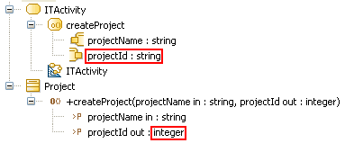

// Disable all captions for figures.
:!figure-caption:

[[R1130]]

[[r1130]]
= R1130

[[Résumé]]

[[résumé]]
===== Résumé

Le type et la multiplicité maximale d'un _Pin_ doivent correspondre au _Parameter_ correspondent de l'_Operation_.

[[Détails]]

[[détails]]
===== Détails

Le type et la multiplicité maximale d'un _Pin_ d'une _CallOperationAction_ doivent correspondre au type et à la multiplicité maximale du _Parameter_

correspondant de l'_Operation_.

*Exemple :*

La _CallOperationAction_ "createProject" est invalide car le type du _Pin_ "projectId" ne correspond pas au type du _Parameter_ correspondant de l'_Operation_.

[[Conseils]]

[[conseils]]
===== Conseils

Cette erreur indique un problème de cohérence entre les _Parameter_ tels qu'ils sont décrits dans le modèle statique et les _Pin_ censés les représenter dans le modèle dynamique.

