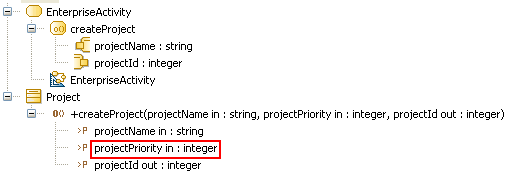

// Disable all captions for figures.
:!figure-caption:

[[R1140]]

[[r1140]]
= R1140

[[Résumé]]

[[résumé]]
===== Résumé

Les _Pin_ d'une _CallOperationAction_ doivent correspondre aux _Parameter_ de l'_Operation_ appelée.

[[Détails]]

[[détails]]
===== Détails

_Contraintes UML_:

* Le nombre de _InputPin_ du _CallOperationAction_ et le nombre de _Parameter_ de type " _in »_ et " _inout »_ de l'_Operation_ doivent être égaux.
* Le nombre de _OutputPin_ du _CallOperationAction_ et le nombre de _Parameter_ de retour et de type " _out »_ et " _inout »_ de l'_Operation_ doivent être égaux.

*Exemple :*

La _CallOperationAction_ "*createProject*" est invalide car le _Parameter_ "*projectPriority*" de l'_Operation_ "*createProject*" appelée ne correspond pas à un de ses _Pins_.

[[Tips]]

[[tips]]
===== Tips

* Les _Parameter_ dont la valeur est donnée par une constante peuvent être représentés par un _ValuePin_ plutôt qu'un simple _InputPin_.
* Les _Parameter_ de type " _inout_ " doivent être représentés par un _InputPin_ pour l'aspect " _in_ " et un _OutputPin_ pour l'aspect " _out_ ".
* Les _Parameter_ de retour doivent être représentés par un _OutputPin_.

