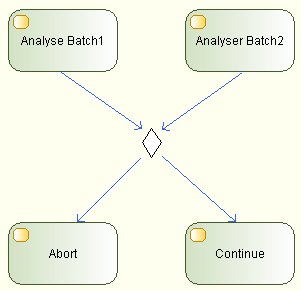
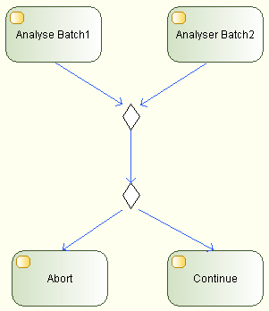

// Disable all captions for figures.
:!figure-caption:
// Path to the stylesheet files
:stylesdir: .

[[R1190]]

[[r1190]]
= R1190

[[Résumé]]

[[résumé]]
===== Résumé

Un nœud _DecisionMerge_ devrait être utilisé soit en tant que nœud de décision, soit en tant que nœud de fusion.

[[Détails]]

[[détails]]
===== Détails

Bien que Modelio utilise le même symbole afin de représenter les nœuds de décision et les nœuds de fusion, un nœud _DecisionMerge_ ne devrait pas être utilisé dans les deux configurations simultanément.

Ci-dessous un exemple de nœud de DecisionMerge utilisé dans les deux configurations en même temps:

Ci-dessous la bonne façon de représenter l'exemple précédent :

Ce deuxième diagramme d'exemple permet par exemple d'exprimer plus facilement et plus clairement que le premier nœud est en charge de réunir le résultat des deux analyses (par exemple : on garde le résultat le plus probant) et que le deuxième nœud prend une décision en fonction de cette réunion (par exemple : continuer si le résultat dépasse un certain seuil). Ceci est plus difficilement exprimable sur le premier diagramme d'exemple.

[[Conseils]]

[[conseils]]
===== Conseils

Il est généralement conseillé de distinguer entre l'aspect fusion et l'aspect décision afin d'éviter une confusion entre les conditions de fusion et les critères de choix de la décision.

