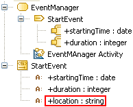

// Disable all captions for figures.
:!figure-caption:
// Path to the stylesheet files
:stylesdir: .

= R1380

===== Résumé

Les _InputPin_ du _SendSignalAction_ doivent correspondre aux _Attributes_ du _Signal_.

===== Détails

_Contrainte UML_:

* Le nombre et l'ordre des _InputPin_ doivent être les mêmes que le nombre et l'ordre des _Attributes_ du _Signal_.

*Exemple :*

Le _SendSignalAction_ "StartEvent" est invalide car l'_Attribut_ "location" du _Signal_ "StartEvent" appelé ne correspond à aucun _InputPin_.

===== Conseils

Si vous avez une erreur R1380, vérifiez que:

* Il y a le même nombre d'_Attributes_ sur le _Signal_ que d'_InputPin_ sur le _SendSignalAction_.
* Chaque _Attribute_ est représenté par un et un seul _InputPin_.

