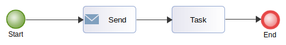
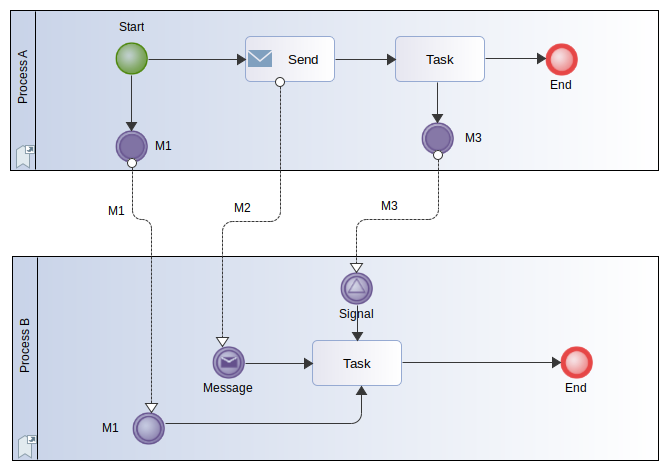

// Disable all captions for figures.
:!figure-caption:
// Path to the stylesheet files
:stylesdir: .

= R3320

===== Résumé

Un _MessageFlow_ devrait partir d'un _SendTask/ThrowEvent/ExternalParticipant_ et arriver sur un _ReceiveTask/CatchEvent/ExternalParticipant_.

===== Détails

L'idée derrière cette recommandation est que l'utilisateur lisant le modèle devrait toujours être capable de comprendre comment un processus interagit (ou pas) avec d'autres processus (_MessageFlow_). +
Alors que les choses sont claires dans un diagramme de collaboration, où les _MessageFlows_ sont affichés, elles le sont moins dans un diagramme de processus, dans lequel ces flux n'apparaissent pas. En regardant un diagramme de processus l'utilisateur n'a pas d'indices sur les interactions avec les autres processus, la norme BPMN ne fournit pas de tels indices. Pour améliorer la lisibilité des diagrammes de processus, la règle R3320 recommande d'utiliser des événements Throw/Catch dans les processus collaborant avec d'autres.

La bonne pratique pour représenter des messages entre processus consiste a :

* Partir d'un _ThrowEvent_ ou d'un _External Participant_ et arriver sur un _CatchEvent_, un _ReceiveTask_ ou un _External Participant_.
* Partir d'un _SendTask_ ou d'un _External Participant_ et arriver sur un _ReceiveTask_ ou un _External Participant_.

Les participants "externes" représentant des processus sans détails internes sont autorisés à la fois en tant que source et cible des _MessageFlows_.

===== Conseils

Si vous avez des _MessageFlows_ reliant d'autres types d'éléments, vous devriez changer leurs origines/destinations.

===== Exemple

Diagramme de collaboration initial

Dans le diagramme de collaboration suivant, les 3 _MessageFlows_ M1, M2 et M3 entre les processus A et B sont parfaitement conformes à la norme.

image::images/Modeler_audit_rules_R3320_Collaboration1.png[1]

Diagramme de processus initial de *Process A*

Avec ce diagramme, l'utilisateur ne peut pas savoir que le *Process A* interagit avec le *Process B*, ce qui peut être gênant.

Dans cet exemple, la règle R3320 signalera les _MessageFlows_ M1 et M3 mais ne mentionnera pas M2 puisqu'il part d'une _SendTask_.

Pour M1 et M3, qui partent du Participant "Process A" et de la _Task_ "task", la règle recommandera de corriger le modèle.

===== Corrections pour M1 et M3

La correction consiste à insérer des Throw/Catch Events dans les processus "Process A" et "Process B" et les utiliser comme source/cible pour M1 et M3 :

Diagramme de processus de *Process A* corrigé

image::images/Modeler_audit_rules_R3320_ProcessA2.png[4]

Diagramme de collaboration corrigé

*Conclusion* : Le principal bénéfice de cette correction est que le diagramme de processus du "Process A" seul est maintenant suffisant pour comprendre que des événements sont propagés à l'extérieur du processus, M1 et M3 y apparaissant. L'utilisateur lisant le modèle est donc invité à consulter le diagramme de collaboration dans lequel les messages M1 et M3 apparaissent explicitement.

